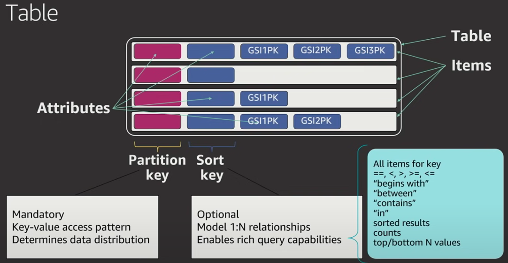
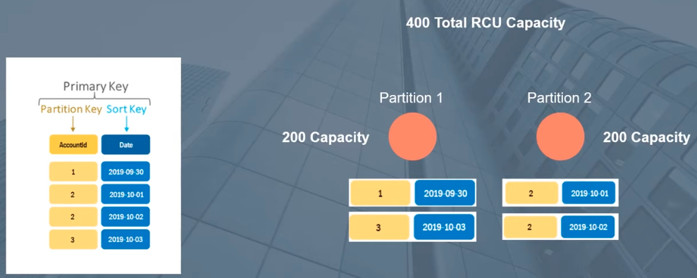
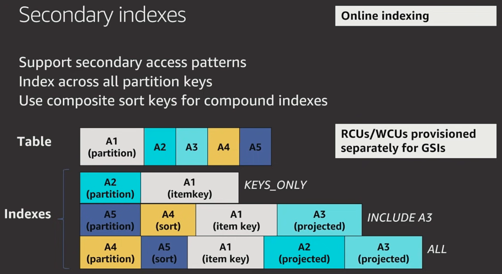

# AWS DynamoDB

Amazon DynamoDB is a fully managed NoSQL database service that provides fast and predictable performance with seamless scalability. 

## Key Concepts

### Tables, Items and Attributes



Tables, items, and attributes are the core building blocks of DynamoDB.
A ***table*** is a grouping of data records.                                e.g Users Table
An ***item*** is a single data record in a table.                          e.g Single User
***Attributes*** are pieces of data attached to a single item.    e.g. User's name

#### Attribute Types

| Type       | Identifier | Example                                                    |
| ---------- | ---------- | ---------------------------------------------------------- |
| String     | S          | `"Name": { "S": "Alex DeBrie" }`                           |
| Number     | N          | `"Age": { "N": "29" }`                                     |
| Binary     | B          | `"SecretMessage": { "B": "bXkgc3VwZXIgc2VjcmV0IHRleHQh" }` |
| Boolean    | BOOL       | `"IsActive": { "BOOL": "false" }`                          |
| Null       | NULL       | `"OrderId": { "NULL": "true" }`                            |
| List       | L          | `"Roles": { "L": [ "Admin", "User" ] }`                    |
| Map        | M          | below                                                      |
| String Set | SS         | `"Roles": { "SS": [ "Admin", "User" ] }`                   |
| Number Set | NS         | `"RelatedUsers": { "NS": [ "123", "456", "789" ] }`        |
| Binary Set | BS         | below                                                      |

```json
// Map type
"FamilyMembers": {
  "M": {
    "Bill Murray": {
      "Relationship": "Spouse",
      "Age": 65
    },
    "Tina Turner": {
      "Relationship": "Daughter",
      "Age": 78,
      "Occupation": "Singer"
    }
  }
}

// Binary Set
"SecretCodes": { "BS": [ 
	"c2VjcmV0IG1lc3NhZ2UgMQ==", 
	"YW5vdGhlciBzZWNyZXQ=", 
	"dGhpcmQgc2VjcmV0" 
] }
```


### Primary Key

Each **item** in a table is uniquely identified by a **primary key**. 
2 types of primary key:

1. **Partition Key** : A simple primary key, composed of one attribute known as the *partition key*.
2. **Partition Key** + **Sort Key**: Referred to as a *composite primary key*, key is composed of two attributes...combination must be Globally unique



##### Design Rule of Thumb

- Are you always doing lookups of a know key, and is it globally unique? ........ Use **Partitiion Key**
- Is your key non-unique, or do you want to do range like queries based off some other value(e.g. date) ....... Use **Partition key + Sort Key**
- Other strategies....
  - Use Prefixes/Suffixes
  - Composed partition keys
  - DynamoDB Accelerator (DAX) .... will occur extra cost

###### Reading

- [Choosing the Right DynamoDB Partition Key](https://aws.amazon.com/blogs/database/choosing-the-right-dynamodb-partition-key/)
- [Simulating Amazon DynamoDB unique constraints using transactions](https://aws.amazon.com/blogs/database/simulating-amazon-dynamodb-unique-constraints-using-transactions/)


### Secondary Indexes



A *secondary index* lets you query the data in the table using an alternate key
2 types of primary key:

1. **Global secondary index** – An index with a partition key and sort key that can be different from those on the table.
2. **Local secondary index** – An index that has the same partition key as the table, but a different sort key.

### DynamoDB Streams

Captures data modification events in DynamoDB tables.
DynamoDB Streams writes a stream record whenever one of the following events occurs:

- A new item is added to the table
- An item is updated
- An item is deleted from the table

---

## DynamoDB API

### Control Plane

*Control plane* operations let you create and manage DynamoDB tables

### Data Plane

Lets you perform CRUD operations on items in a Table.
Can use PartiQL or Classic APIs to do this.

### DynamoDB Streams

*DynamoDB Streams* operations let you enable or disable a stream on a table, and allow access to the data modification records contained in a stream

### Transactions

*Transactions* provide atomicity, consistency, isolation, and durability (ACID) enabling you to maintain data correctness in your applications more easily.
Can use PartiQL or Classic APIs to do this.

---

## Local Setup

Can be deployed locally either

- [amazon/dynamodb-local](amazon/dynamodb-local) Docker image
- Localstack
- Localstack + Terraform

---

## Access DynamoDB

- AWS Management Console
- AWS CLI
- API
  - Python: [boto3](https://aws.amazon.com/sdk-for-python/)
- [AWS NoSQL Workbench](https://docs.aws.amazon.com/amazondynamodb/latest/developerguide/workbench.html)

---

## Setting Up Env to Work with DynamoDB

### Locally

#### Run on Localstack for DynamoDB

```yaml
# docker-compose.yml
version: '3.0'

services:
  localstack:
    image: localstack/localstack:latest
    environment:
      - AWS_DEFAULT_REGION=us-east-1
      - EDGE_PORT=4566
      - SERVICES=dynamodb
    ports:
      - '4566:4566'
    volumes:
      - "${TMPDIR:-/tmp/localstack}:/tmp/localstack"
      - "/var/run/docker.sock:/var/run/docker.sock"
```

```bash
# command line
docker compose up
```

```bash
# command line
export AWS_ACCESS_KEY_ID=test
export AWS_SECRET_ACCESS_KEY=test
export AWS_REGION=us-east-1

aws --endpoint-url http://localhost:4566 <aws command>
```

#### DynamoDB Local

```yaml
# docker-compose.yml
version: '3.8'
services:
  dynamodb-local:
    command: "-jar DynamoDBLocal.jar -sharedDb -dbPath ./data"
    image: "amazon/dynamodb-local:latest"
    container_name: dynamodb-local
    ports:
      - "8000:8000"
    volumes:
      - "./docker/dynamodb:/home/dynamodblocal/data"
    working_dir: /home/dynamodblocal
```

```bash
# command line
docker-compose up
```

```bash
# command line
export AWS_ACCESS_KEY_ID=test
export AWS_SECRET_ACCESS_KEY=test
export AWS_REGION=us-east-1

aws --endpoint-url http://localhost:8000 <aws command>
```


---

## AWS CLI

#### Credentials

```bash
# with keys
export AWS_ACCESS_KEY_ID=sample-access-key
export AWS_SECRET_ACCESS_KEY=sample-secret-key
export AWS_DEFAULT_REGION=eu-west-1

# with profile
export AWS_PROFILE=profile-name
export AWS_DEFAULT_REGION=eu-west-1
```

### Create a Table

Create a `Music` table 

- Partition Key - `Artist`
- Sort Key - `SongTitle`

```bash
aws dynamodb create-table \
    --table-name Music \
    --attribute-definitions \
        AttributeName=Artist,AttributeType=S \
        AttributeName=SongTitle,AttributeType=S \
    --key-schema \
        AttributeName=Artist,KeyType=HASH \
        AttributeName=SongTitle,KeyType=RANGE \
    --provisioned-throughput \
        ReadCapacityUnits=10,WriteCapacityUnits=5
```

Console Output

```json
{
  "TableDescription":{
    "AttributeDefinitions":[
      {
        "AttributeName":"Artist",
        "AttributeType":"S"
      },
      {
        "AttributeName":"SongTitle",
        "AttributeType":"S"
      }
    ],
    "TableName":"Music",
    "KeySchema":[
      {
        "AttributeName":"Artist",
        "KeyType":"HASH"
      },
      {
        "AttributeName":"SongTitle",
        "KeyType":"RANGE"
      }
    ],
    "TableStatus":"ACTIVE",
    "CreationDateTime":"2021-09-01T16:40:02.950000+01:00",
    "ProvisionedThroughput":{
      "LastIncreaseDateTime":"1970-01-01T00:00:00+00:00",
      "LastDecreaseDateTime":"1970-01-01T00:00:00+00:00",
      "NumberOfDecreasesToday":0,
      "ReadCapacityUnits":10,
      "WriteCapacityUnits":5
    },
    "TableSizeBytes":0,
    "ItemCount":0,
    "TableArn":"arn:aws:dynamodb:us-east-1:000000000000:table/Music"
  }
}
```

### Check Table Status

```bash
aws dynamodb describe-table --table-name Music | grep TableStatus
or
aws dynamodb describe-table --table-name Music | jq .Table.TableStatus
```

Console Output

```json
"TableStatus": "ACTIVE",
```

### Insert Data into Table

```bash
aws dynamodb put-item \
    --table-name Music  \
    --item '{"Artist": {"S": "No One You Know"}, "SongTitle": {"S": "Call Me Today"}, "AlbumTitle": {"S": "Somewhat Famous"}, "Awards": {"N": "1"}}'
```

Console Output

```json
{
  "ConsumedCapacity":{
    "TableName":"Music",
    "CapacityUnits":1.0
  }
}
```

### Read Table

```bash
aws dynamodb scan --table-name Music
```

Console Output

```json
{
  "Items":[
    {
      "Artist":{
        "S":"No One You Know"
      },
      "AlbumTitle":{
        "S":"Somewhat Famous"
      },
      "Awards":{
        "N":"1"
      },
      "SongTitle":{
        "S":"Call Me Today"
      }
    }
  ],
  "Count":1,
  "ScannedCount":1,
  "ConsumedCapacity":null
}
```


---

## Python SDK

### Create a Table

```python
import boto3

# Get the service resource.
dynamodb = boto3.resource('dynamodb')

# Create the DynamoDB table.
table = dynamodb.create_table(
    TableName='users',
    KeySchema=[
        {
            'AttributeName': 'username',
            'KeyType': 'HASH'
        },
        {
            'AttributeName': 'last_name',
            'KeyType': 'RANGE'
        }
    ],
    AttributeDefinitions=[
        {
            'AttributeName': 'username',
            'AttributeType': 'S'
        },
        {
            'AttributeName': 'last_name',
            'AttributeType': 'S'
        },
    ],
    ProvisionedThroughput={
        'ReadCapacityUnits': 5,
        'WriteCapacityUnits': 5
    }
)

# Wait until the table exists.
table.meta.client.get_waiter('table_exists').wait(TableName='users')

# Print out some data about the table.
print(table.item_count)
```

### Get Existing Table

```python
import boto3

# Get the service resource.
dynamodb = boto3.resource('dynamodb')

# Instantiate a table resource object without actually creating a DynamoDB table. 
# Note: the attributes of this table are lazy-loaded: a request is not made nor are the attribute
# values populated until the attributes on the table resource are accessed or its load() method is called.
table = dynamodb.Table('users')

# Print out some data about the table.
# This will cause a request to be made to DynamoDB and its attribute values will be set based on the response.
print(table.creation_date_time)
```

### Create a new item

```python
table.put_item(
   Item={
        'username': 'janedoe',
        'first_name': 'Jane',
        'last_name': 'Doe',
        'age': 25,
        'account_type': 'standard_user',
    }
)
```

### Get an item

```python
response = table.get_item(
    Key={
        'username': 'janedoe',
        'last_name': 'Doe'
    }
)
item = response['Item']
print(item)
```

### Update an item

```python
table.update_item(
    Key={
        'username': 'janedoe',
        'last_name': 'Doe'
    },
    UpdateExpression='SET age = :val1',
    ExpressionAttributeValues={
        ':val1': 26
    }
)
```

### Delete an item

```python
table.delete_item(
    Key={
        'username': 'janedoe',
        'last_name': 'Doe'
    }
)
```

### Batch Write

```python
with table.batch_writer() as batch:
    batch.put_item(
        Item={
            'account_type': 'standard_user',
            'username': 'johndoe',
            'first_name': 'John',
            'last_name': 'Doe',
            'age': 25,
            'address': {
                'road': '1 Jefferson Street',
                'city': 'Los Angeles',
                'state': 'CA',
                'zipcode': 90001
            }
        }
    )
    batch.put_item(
        Item={
            'account_type': 'super_user',
            'username': 'janedoering',
            'first_name': 'Jane',
            'last_name': 'Doering',
            'age': 40,
            'address': {
                'road': '2 Washington Avenue',
                'city': 'Seattle',
                'state': 'WA',
                'zipcode': 98109
            }
        }
    )
    ...
```

### Batch Write with Deduplication

```python
with table.batch_writer(overwrite_by_pkeys=['partition_key', 'sort_key']) as batch:
    batch.put_item(
        Item={
            'partition_key': 'p1',
            'sort_key': 's1',
            'other': '111',
        }
    )
    batch.put_item(
        Item={
            'partition_key': 'p1',
            'sort_key': 's1',
            'other': '222',
        }
    )
    batch.delete_item(
        Key={
            'partition_key': 'p1',
            'sort_key': 's2'
        }
    )
    batch.put_item(
        Item={
            'partition_key': 'p1',
            'sort_key': 's2',
            'other': '444',
        }
    )
```

### Querying and scanning

```python
from boto3.dynamodb.conditions import Key, Attr

# This queries for all of the users whose username key equals johndoe
response = table.query(
    KeyConditionExpression=Key('username').eq('johndoe')
)
items = response['Items']
print(items)


#  scans for all the users whose age is less than 27
response = table.scan(
    FilterExpression=Attr('age').lt(27)
)
items = response['Items']
print(items)


# scans for all users whose first_name starts with J and whose account_type is super_user
response = table.scan(
    FilterExpression=Attr('first_name').begins_with('J') & Attr('account_type').eq('super_user')
)
items = response['Items']
print(items)


# scan based on conditions of a nested attribute. For example this scans for all users whose state in their address is CA
response = table.scan(
    FilterExpression=Attr('address.state').eq('CA')
)
items = response['Items']
print(items)
```

### Delete a Table

```python
table.delete()
```


## Terraform

#### Docs

- [Resource: aws_dynamodb_table](https://registry.terraform.io/providers/hashicorp/aws/latest/docs/resources/dynamodb_table)

### Create tf file to store aws provider

```bash
touch aws.tf
```

```json
terraform {
  required_providers {
    aws = {
      source  = "hashicorp/aws"
      version = "~> 3.0"
    }
  }
}

provider "aws" {
  region  = "eu-west-1"
  profile = "aws-profile"
}
```


### Create file to store dynamodb 

##### Sample: Create Music Table with Partition Key and Sort Key using Provisioned billing mode

```json
resource "aws_dynamodb_table" "Music" {
  name           = "Music"
  read_capacity  = 5
  write_capacity = 5
  hash_key       = "Artist"
  range_key      = "SongTitle"

  attribute {
    name = "Artist"
    type = "S"
  }
  attribute {
    name = "SongTitle"
    type = "S"
  }
  tags = {
    Name        = "dynamodb-table-1"
    Environment = "production"
  }
}
```

##### Sample: Create Music Table with Partition Key and Sort Key using Provisioned billing mode

```bash
resource "aws_dynamodb_table" "blynch-test-table" {
  name         = "TestTable"
  billing_mode = "PAY_PER_REQUEST"
  hash_key     = "unique_id"

  attribute {
    name = "unique_id"
    type = "S"
  }
  attribute {
    name = "customer"
    type = "S"
  }
  # attribute {
  #   name = "date"
  #   type = "N"
  # }

  global_secondary_index {
    name               = "CustomerIndex"
    hash_key           = "customer"
    # range_key          = "date"
    projection_type    = "INCLUDE"
    non_key_attributes = ["size"]
  }
}
```

