# API Gateway

### What is an API

#### Example: REST API

- Client makes a request to an API
- API will talk to services behind it (AWS Lambda)
- API returns a response to the Client

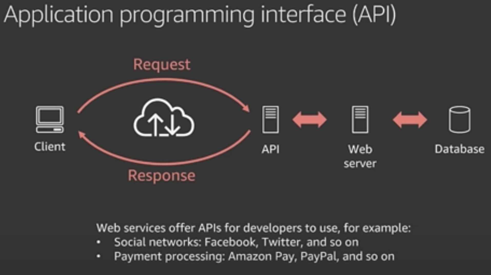 

### What is API Gateway

- A fully managed service that makes it easy for developers to create, publish, maintain, monitor and secure APIs at any scale.

### Architecture

> 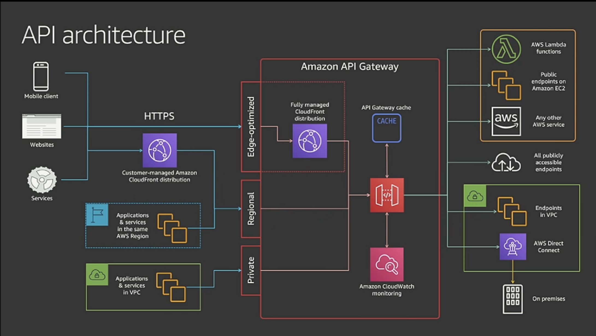

### How to talk to API Gateway

- Edge optimised
  - designed for globally distributed set of clients
- Regional
  - recommended for **general use cases**
  - used for **clients in the same region**
- Private
  - Only accessible from withing a VPC(and networks connected to a VPC)
  - APIs used internally or by private microservices

### What can API Gateway talk to?

- AWS Services
  - Lambda
- Stuff inside VPC
- Anything that has an HTTP endpoint

### Supported Protocols

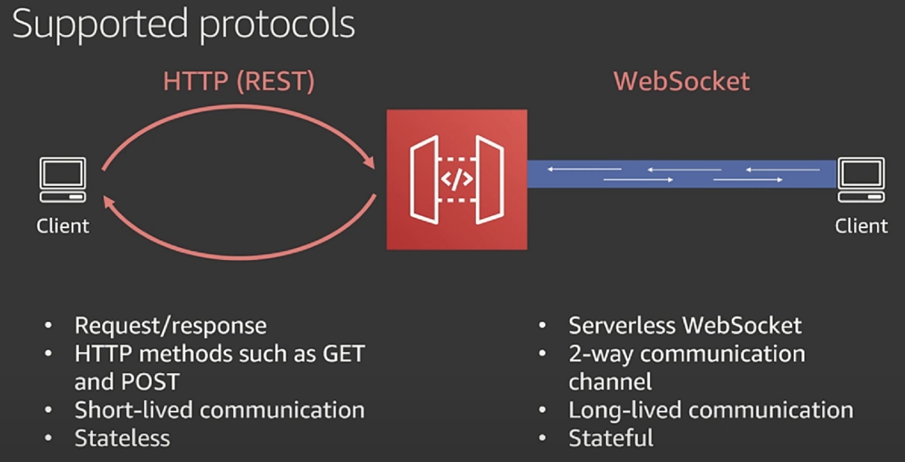 

- HTTP
  - Request and Response
  - "I'm asking you something, and you tell me something back"
- Websocket
  - "I'm going to connect to you....and youre going to be connected to me......amd we're going to be sending info back and forth as needed"
  - Good for chat clients

### Integrations

> 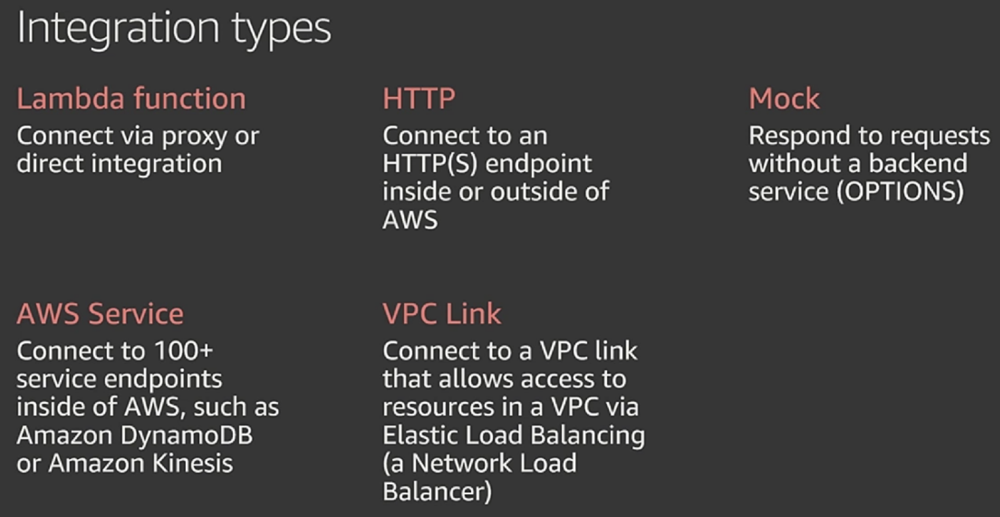 

### Lambda funciton Integration Options

#### Proxy Connection

> 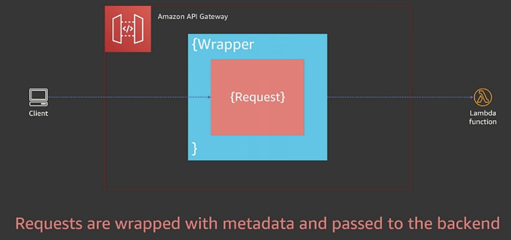 
>
> - Client sends request
>
> - API Gateway wraps it with some metadata
>
>   - adds contextual data you may need on the backend
>
> - Lambda get that and sends it back
>
>   - API Gateway doesnt handle status codes, headers etc...
>
>   > 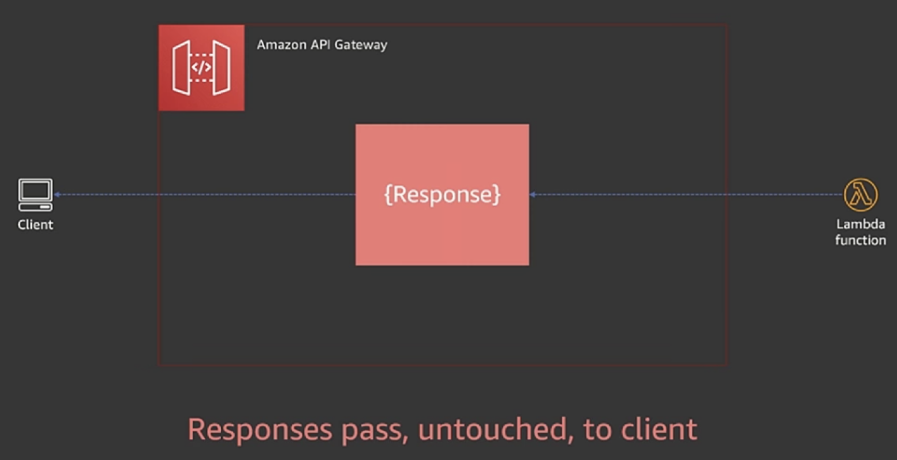 

#### Integration

> 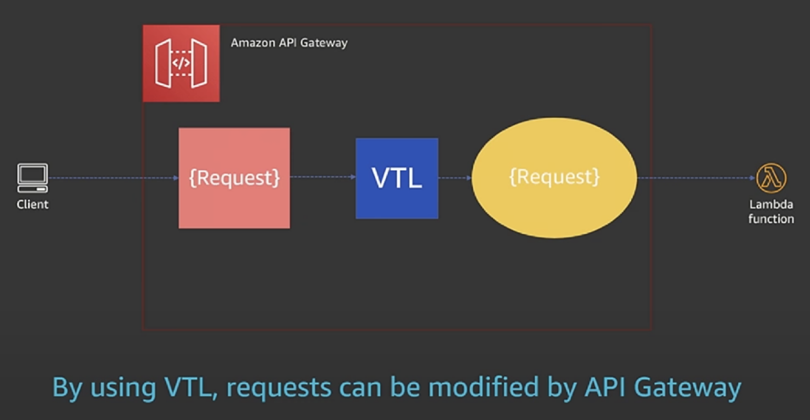 
>
> - Client sends request
>
> - VTL used to modify the request
>
>   - can use logic
>   - can use static data
>
> - Lambda gets that and send back response
>
>   > 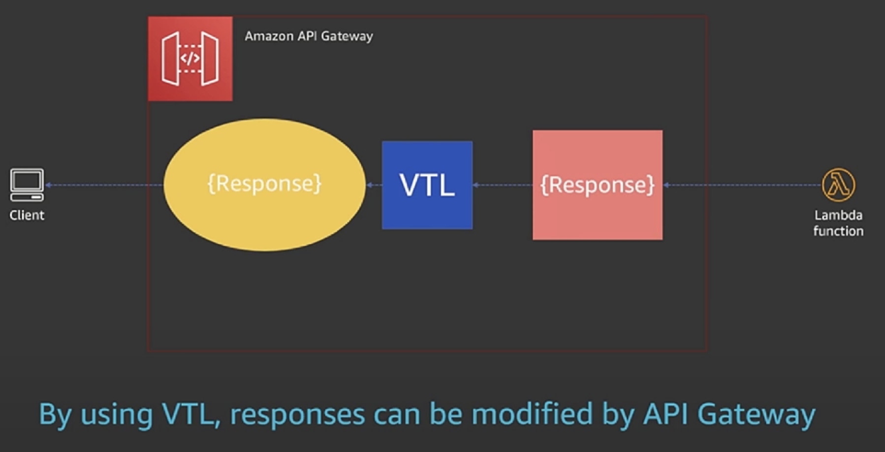 
>   >
>   > - response can be modified again using VTL
>
> #### VTL Example
>
> 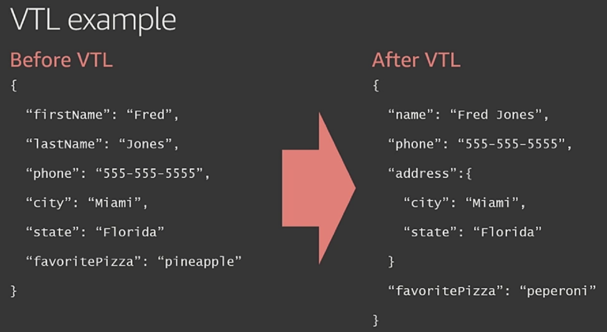 

#### Integration Flow

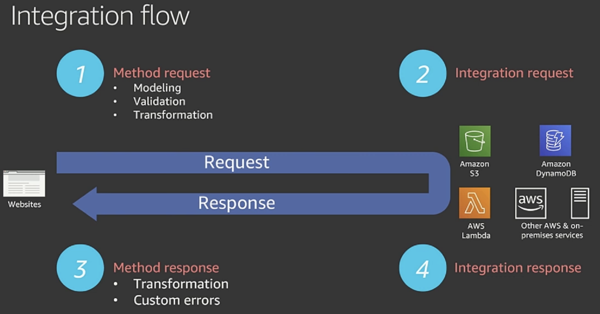 

- Method Request
  - Can you validation before a request goes to the Lambda service

### Authorization

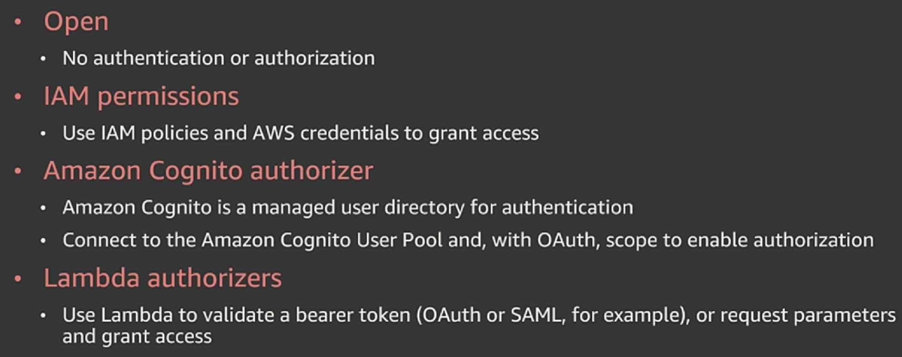 

Can attached Authoriser to API Gateway

## Optimising

### Caching

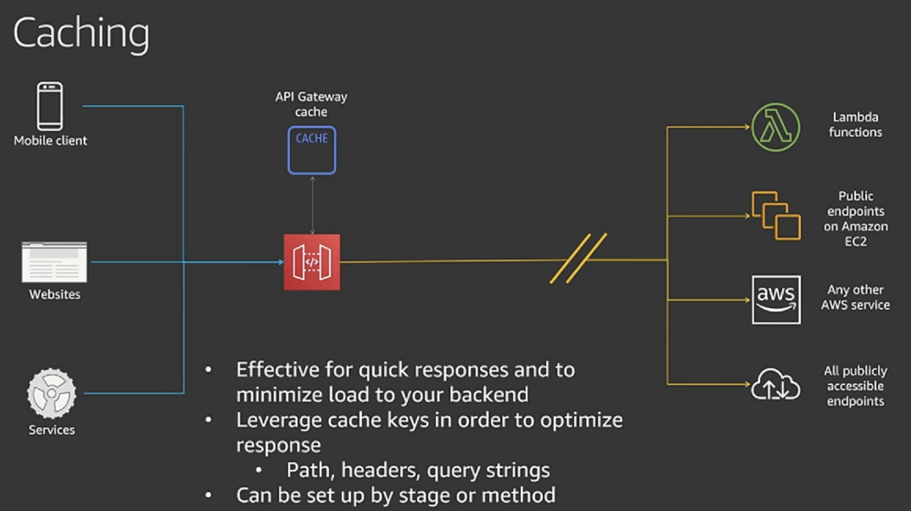 

- Can turn on caching
- Managed through API Gateway
- Can be set up for stage
  - Can have caching turned off for dev and turned on for prod

### Throttling

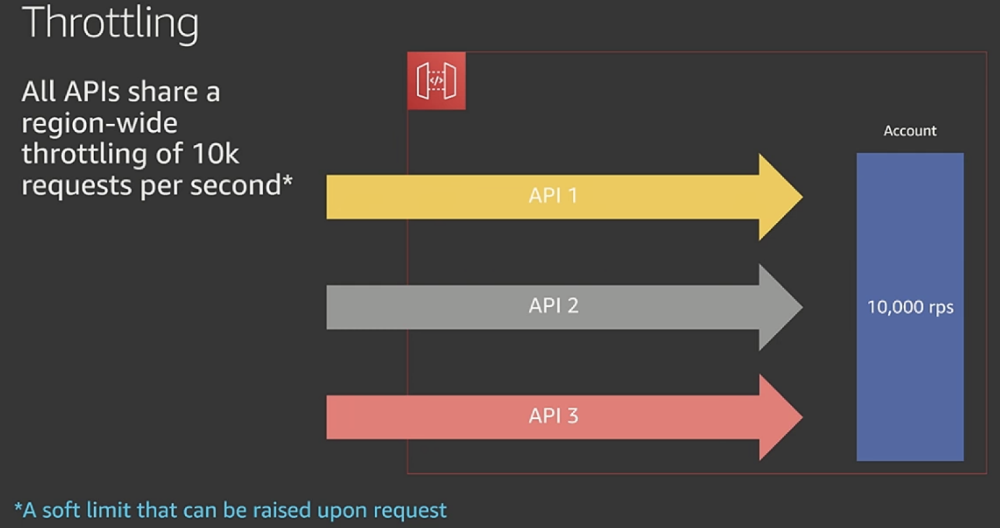 

### VPC

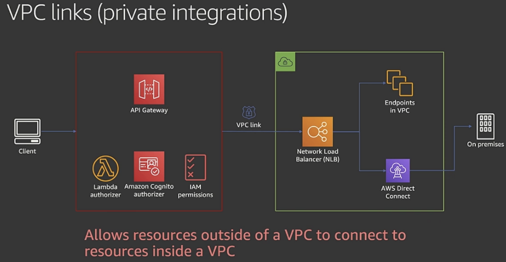 

### Web Applicaiton Firewall

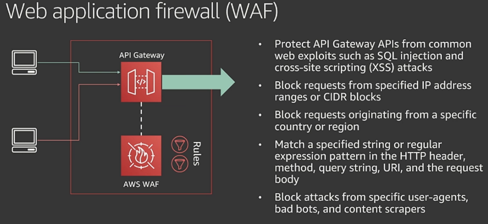 

- Can blacklist
  - IP address
  - geolocation
  - request size limit

### Resource Policies

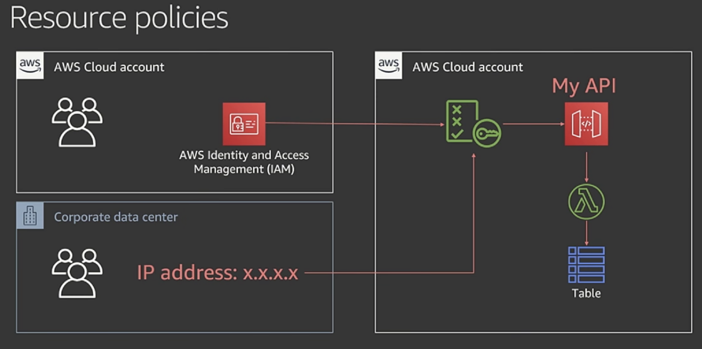

### Client Certificates

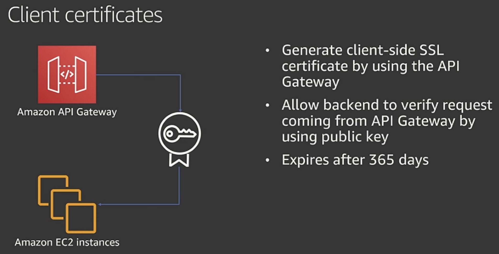 

### Swagger/OpenAPI import and export

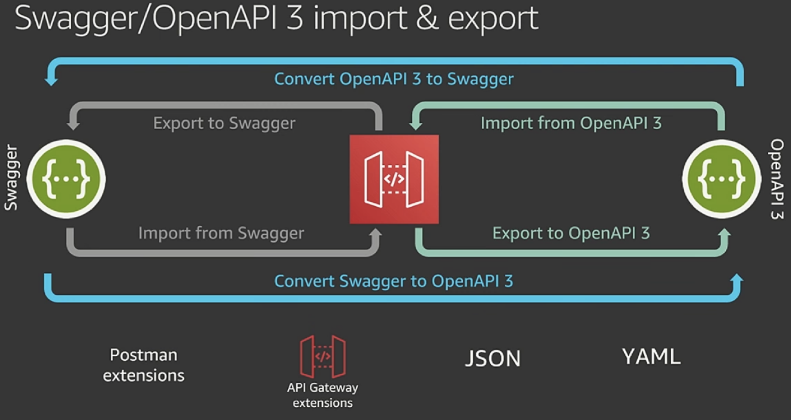

---

## Links

- Youtube: [AWS re:Invent 2019: [REPEAT 2] I didn’t know Amazon API Gateway did that (SVS212-R2)](https://www.youtube.com/watch?v=yfJZc3sJZ8E&ab_channel=AWSEvents)

