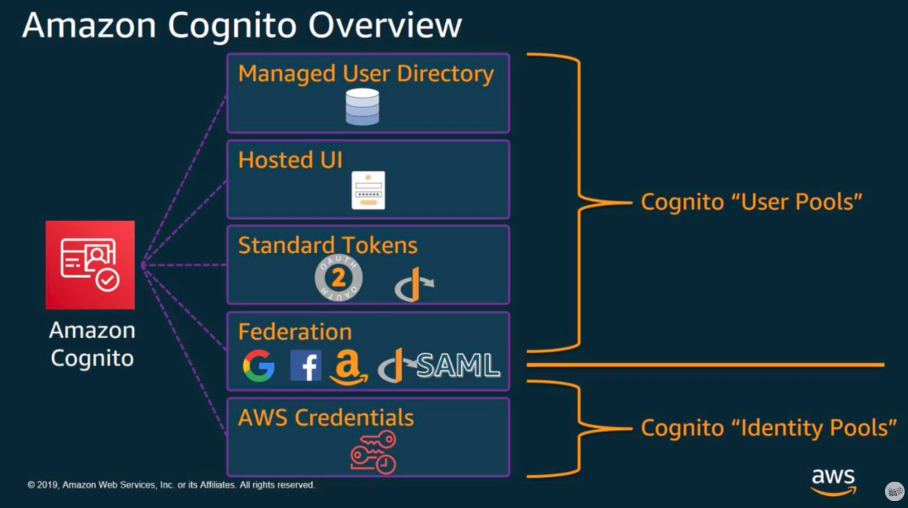
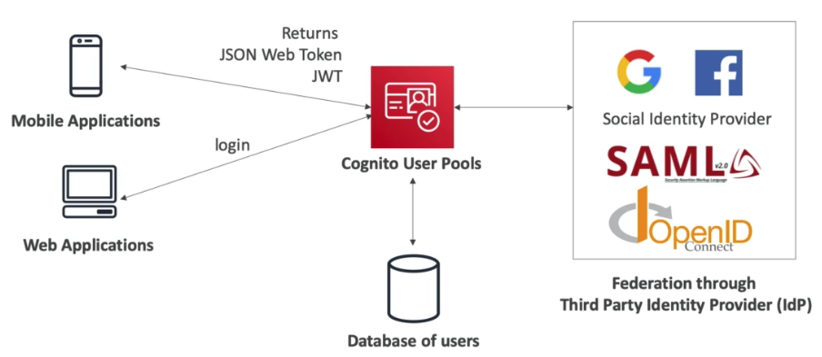
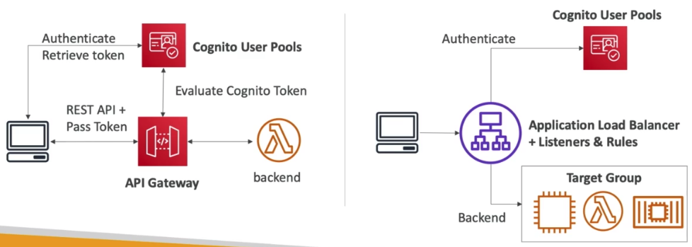
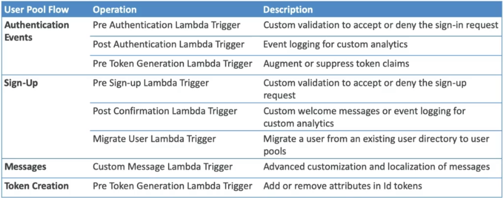
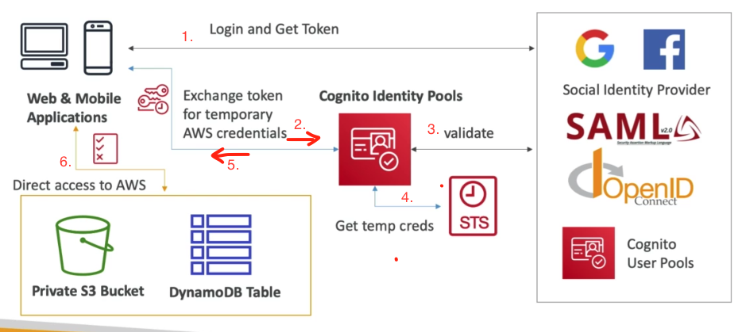
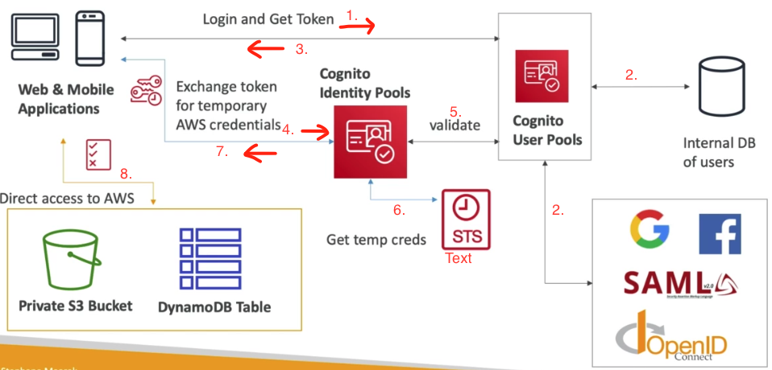
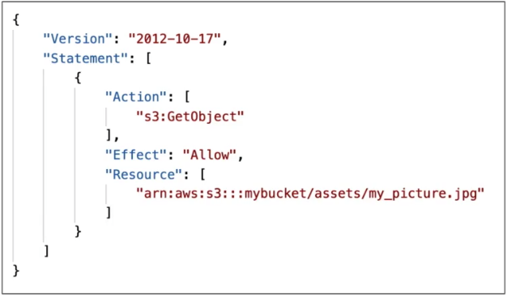
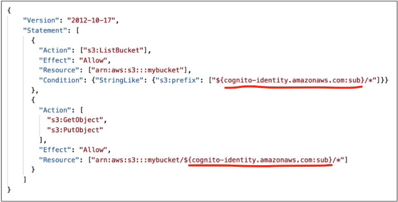
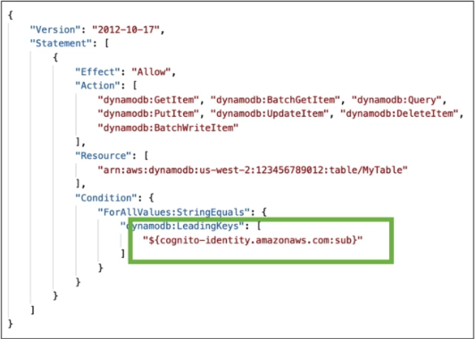

# AWS Cognito - Sign Up/Sign In as a Service

 

 

Cognito is used to give users an Identity so they can interact with out Application. 
Amazon Cognito provides **authentication**, **authorization**, and **user management** for your web and mobile apps.
This is different to IAM.

Main Components of AWS Cognito:

- Cognito User Pools
- Cognito Identity Pools
- Cognito Sync

---

### Preface

> ##### Terms
>
> | Term                              | Description                                                  |
> | --------------------------------- | ------------------------------------------------------------ |
> | JWT(JSON Web token)               | base 64 encoded json containg Header, Payload and Signature  |
> | Access Token                      | Bearer token used to access resources. [OAuth Access Tokens Explained](https://www.youtube.com/watch?v=BNEoKexlmA4) |
> | Bearer Token                      | Predominant type of access token used with OAuth 2.0. It is is an opaque string, not intended to have any meaning to clients using it |
> | Refresh Token                     | used to obtain a new Access Token                            |
> | [OAuth 2.0](https://oauth.net/2/) | OAuth 2.0 is the industry-standard protocol for authorization. |
>

Authentication - Who am I?
Authorisation   - What I can use?

### Authentication

> Authentication is the act of validating that users are whom they claim to be.

Most common ways to Authenticatie

- Username and password
- OTPs
- Biometrics
- SSO(Single Sign On)

### Authorisation

> Authorization in a system security is the process of giving the user permission to access a specific resource or function.

Once authenticated, a user must be provided with relevent access. Even a guest user can have minimum access

Users can be devided into 4 categories

- Admin of the application
- Authenticated user
- Premium User
- Guest User

### Federation

> a united, trusted relationship between two or more entities

- **Identity Federation**
  - system of trust between 2 parties, to authenticate users and 
    also convey the information required for giving authorization.
- **Identity Provider**
  - The party in identity federation, which stores the user information, responsible for user authentication
- **Service Provider**
  - The party in identity federation, which provides the service based on authentication and authorization provided by Identity provider.
- **Open Standards**
  - Identity federation is possible because of these open standards
    - OIDC (OpenID Connect)
    - SAML (Security assertion markup language) 2.0
    - OAuth 2.0

### Analogy using a Nightclub

| Term                | Comparison                                                   |
| ------------------- | ------------------------------------------------------------ |
| Service Provider    | The nightclub                                                |
| Identity Provider   | Irish government, provides identity by use of a passport     |
| Identity Federation | Their is trust between the Nightclub and the Irish Government |
| Open Standards      | Passports provided by the Irish Government adhere to a specific standard |
| Authentication      | Gaining access to get inside by providing you ID             |
| Authorisation       | Places you are allowed to go and things you are allowed to do inside the nightclub |

| People (Users)  | Rooms (Resources) | Functions                   | JWT / Cookie |
| --------------- | ----------------- | --------------------------- | ------------ |
| Guest           | Dancefloor        | Dance                       | Wristband    |
| VIP Guest       | Bar Area          | Buy Drink / Comsume a Drink | Stamp        |
| Barman          | DJ Booth          | Make a Drink                |              |
| Security        | Store Room        | Play a song                 |              |
| DJ              | Owners Office     | Request a song              |              |
| Nightclub Owner | Toilets           | Smoke a cigerette           |              |
|                 | VIP Area          |                             |              |
|                 | Smoking Area      |                             |              |

Before you enter the nightclub you are Authenticated. 

- Name and password approach: If the nightclub keep a store of all their guests, you will show your loyalty card or give you name and address.
- SSO Approach: You will show your passport. The Nightclub has a system of trust with the Government who issued the passport.

Once Authenticated, you will be given a token that proves authentication and a User status

- If you pay the basic amount, you will be given Guest user permissions and given a stamp or wristband to show
- If you pay a higher amount, you will be given VIP Guest access and get access to more areas than a basic Guest

**Authorisation**: Once granted access, as a Guest, you have authorisation to access certain area an perform certain tasks

**JWT/Cookie**: Once you are authorised, you get a stamp on your hand or wristband. This lets security know that you have been given access.

 You can access the dance floor, the bar, toilets, and the seating areas, you can buy a drink, drink a drink, dance

You cannot access the store room, dj booth or behind the bar. You cannot make a drink, start a fight, change the music

---

## Cognito 

### User Pools (CUP)

AWS Cognito **User Pool**, is a way to provide **Authentication** to user of an Application. 
It is represented as a user directory in Amazon Cognito.

AWS Cognito User pool provide:-

- Sign up and sign in service
- A built-in customizable web-ui for user to register.
- Social sign-in with social identity provider.
- User directory management and user profile.
- MFA.

Once a user is authenticated, the application receives a JWT (JavaScript Web token). 
The next step of **authorizing** uses this JWT.

- Create a serverless database of users for your webapp
- Simple login: Username (or email) / password combination
- Password reset
- Email & Phone number verification
- Multi-factor authentication
- Federated Identities: users from Facebook, Google, SAML...
- Login sends back a JWT

#### App Client

#### High Level Diagram

 

#### Integrations

CUP integrates with API Gateway and Application Load Balancer

 

#### Lambda Triggers

 

#### Hosted Authentication UI

Cognito offers a hosted UI for sign up / sign in

## Cognito Identity Pools (Federated Identities)

- Get identities for "users" so they can obtain temporary AWS credentials
- Your identity pool can include:
  - Public Providers (Login with Amazon, Facebook, Google, Apple)
  - Users in Amazon Cognito Pool
  - OpenID Connect Providers & SAML Identity Providers
  - Developer Authenticated Identities (custom login server)
  - Cognito Identity Pools allow for **<u>unauthenticated (guest) access</u>**
- Users can then access AWS services directly or through API Gateway
  - The IAM policies applied to the credentials are defined in Cognito
  - They can be customised bas on the **user_id** for fine grained control

#### Cognito Identity Pools - Diagram

>  

#### Cognito Identity Pools - Diagram with CUP

> ###### Setup
>
> Want users to be able to connect to private S3 bucket or DynamoDB table, but we want there identiy to be stored in Cognito User Pools
>
>  
>
> 1. Login
> 2. Get token from Internal DB or from Federated Identiy Providers
> 3. User get a JWT from Cognito User Pools
> 4. Sends JWT to Cognito Identiy Pools
> 5. JWT is validated
> 6. Temp credential is gotten from AWS Security Token Service API
> 7. Credentials returned to the user
> 8. User can directly access AWS using credentials

#### Cognito Identity Pools - IAM Roles

- Default IAM roles for authenticated and guest users
- Can define rules to choose the role for each user based on the user's ID
- Can partition your users acces using **policy variables**

- IAM credentials are obtained by Cognito Identity Pools through STS
- The roles must have a "trust" policy of the Cognito Identity Pools

#### Guest User Example

 

Here we have an IAM policy for the following situation

- Want to give guest users access to AWS
- To allow any guest user to do a GET object on a bucket for the file ***my_picture.jpg***

#### Authenticated Users Policy Variable

 

Situation:
Users are authenticated, but S3 bucket access is restricted to buckets that have a prefix that matches the users identity

#### DynamoDB Sample Policy

 

- This policy allows a user to do anything it wants on the DynamoDB table **MyTable**.....
  as long as the leading key for dynamoDB corresponds to the user ID of the user.
- This is effectively row-based security