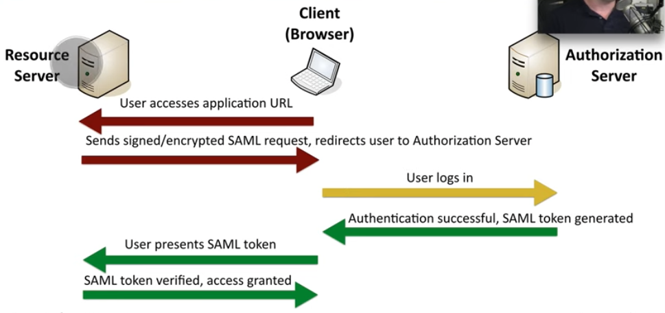

# SAML (Security Assertion Markup Language)

Allows single sign-on within a web browser across a varity of systems

## Preface

### Authentication vs Authorisation

- **<u>Authentication</u>**
  - Determination of who
  - Technically it is the determination if a Principal is who they say they are
  - Principal can be humans or machines
- **<u>Authorisation</u>**
  - Determines what the Principal can or cannot do
  - Is based on authentication
  - Is often called access control

## SAML

Ther is 3 actors in a SAML request

- The **Principal** - the end user who wants to use a web based service
- The **Identity** Provider - the organisation providing proof of identity
- The **Service** Provider - web based service the end user wants to access

### SAML Flow

 

### SAML Terms

| Term                        | Description                                                  |
| --------------------------- | ------------------------------------------------------------ |
| Identity Provider (**IDP**) | Identity store                                               |
| Service Provider (**SP**)   |                                                              |
| SAML Request                | Service provider send communication to the Identity Provider |
| SAML Response               | When the Identity Provider sends a communication back to the Service Provider |
| Assertions                  | Asserted statements about the User that are in the SAML Response |
| XML Signatures (DSig)       | Assertions are signed using XML Signatures                   |
| Assertion Consumer Service  | Endpoint on the Service Provider that the SAML Response is processed It recieves the SAML Response from the Identity Provider, checks the assertions signatures and validates the entire document. |
| Attributes                  | Other pieces of info about the User in the SAML Response (e.g. first name, last name etc....) |
| Relay State                 | Where the user was before they triggered authentication      |
| SAML Trust                  | The configuration between the Identity Provider and the Service Provider |
| Metadata                    | Allows self configuration between Identity Provider and Service Provider. |
|                             |                                                              |

##### Videos

- [How do I set up OneLogin as a SAML identity provider with Amazon Cognito user pool?](https://www.youtube.com/watch?v=FKU3Ai1AzNM)

