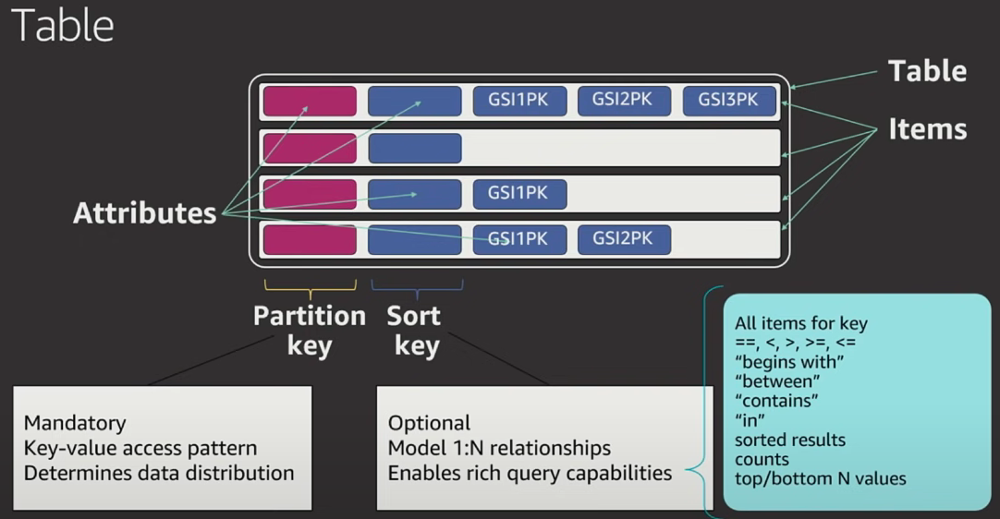
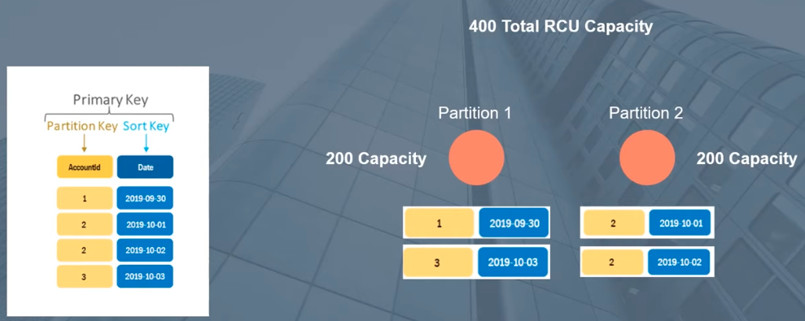
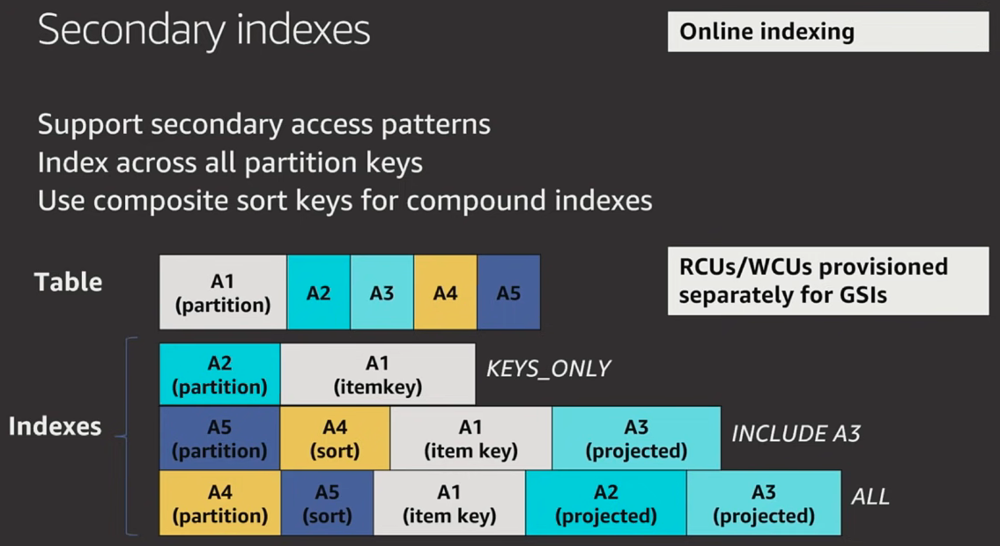

# AWS DynamoDB

## Intro

### What is DynamoDB ?

- **NoSQL** database
- Fully managed by AWS
- HTTPS with AWS Identity and Access Management auth
- Fast consistent performance as it scales

### When to use DynamoDB

- Applications with **large amounts of data** and strict **latency requirements**.
- **Serverless applications** using AWS Lambda/AWS AppSync
- Data sets with **simple, known access patterns**

### Definitions

- **Access Patterns**
  - "Access patterns or query patterns define how the users and the system access the data to satisfy business needs."

### Comparison to Relational Database

- ```python
  # SQL                         DynamoDB
    Table                       Table
    Row                         Item
    Column                      Attributes
    Primary Key                 Simple Primary Key (partition key only)
    Composite Primary Key       Partition Key + Sort Key
  ```

  

## Key Concepts

### Tables, Items and Attributes

 

Tables, items, and attributes are the core building blocks of DynamoDB.
A ***table*** is a grouping of data records.                                e.g Users Table
An ***item*** is a single data record in a table.                          e.g Single User
***Attributes*** are pieces of data attached to a single item.    e.g. User's name

#### Attribute Types

> ###### Types
>
> | Type       | Identifier | Example                                                    |
> | ---------- | ---------- | ---------------------------------------------------------- |
> | String     | S          | `"Name": { "S": "Alex DeBrie" }`                           |
> | Number     | N          | `"Age": { "N": "29" }`                                     |
> | Binary     | B          | `"SecretMessage": { "B": "bXkgc3VwZXIgc2VjcmV0IHRleHQh" }` |
> | Boolean    | BOOL       | `"IsActive": { "BOOL": "false" }`                          |
> | Null       | NULL       | `"OrderId": { "NULL": "true" }`                            |
> | List       | L          | `"Roles": { "L": [ "Admin", "User" ] }`                    |
> | Map        | M          | below                                                      |
> | String Set | SS         | `"Roles": { "SS": [ "Admin", "User" ] }`                   |
> | Number Set | NS         | `"RelatedUsers": { "NS": [ "123", "456", "789" ] }`        |
> | Binary Set | BS         | below                                                      |
>
> ###### Example
>
> ```json
> // Map type
> "FamilyMembers": {
>   "M": {
>     "Bill Murray": {
>       "Relationship": "Spouse",
>       "Age": 65
>     },
>     "Tina Turner": {
>       "Relationship": "Daughter",
>       "Age": 78,
>       "Occupation": "Singer"
>     }
>   }
> }
> 
> // Binary Set
> "SecretCodes": { "BS": [ 
> 	"c2VjcmV0IG1lc3NhZ2UgMQ==", 
> 	"YW5vdGhlciBzZWNyZXQ=", 
> 	"dGhpcmQgc2VjcmV0" 
> ] }
> ```
>

### Primary Key

Each **item** in a table is uniquely identified by a **primary key**. 
2 types of primary key:

1. **Partition Key** : A simple primary key, composed of one attribute known as the *partition key*.
2. **Partition Key** + **Sort Key**: Referred to as a *composite primary key*, key is composed of two attributes...combination must be Globally unique

   1. Note: A sort key can be constructed as a composite key by hastag(**'#'**) seperation

      Link: [Composite sort key building block](https://docs.aws.amazon.com/amazondynamodb/latest/developerguide/data-modeling-blocks.html#data-modeling-blocks-composite)


 

##### Design Rule of Thumb

- Are you always doing lookups of a known key, and is it globally unique? ........ Use **Partitiion Key**
- Is your key non-unique, or do you want to do range like queries based off some other value(e.g. date) ....... Use **Partition key + Sort Key**
- Other strategies....
  - Use Prefixes/Suffixes
  - Composed partition keys
  - DynamoDB Accelerator (DAX) .... will occur extra cost

###### Reading

- [Choosing the Right DynamoDB Partition Key](https://aws.amazon.com/blogs/database/choosing-the-right-dynamodb-partition-key/)
- [Simulating Amazon DynamoDB unique constraints using transactions](https://aws.amazon.com/blogs/database/simulating-amazon-dynamodb-unique-constraints-using-transactions/)
- [Schema Design Examples](https://docs.aws.amazon.com/amazondynamodb/latest/developerguide/data-modeling-schemas.html)


### Secondary Indexes

 

A *secondary index* lets you query the data in the table using an alternate key
2 types of primary key:

1. **Global secondary index** – An index with a partition key and sort key that can be different from those on the table.
2. **Local secondary index** – An index that has the same partition key as the table, but a different sort key.

### DynamoDB Streams

Captures data modification events in DynamoDB tables.
DynamoDB Streams writes a stream record whenever one of the following events occurs:

- A new item is added to the table
- An item is updated
- An item is deleted from the table

---

## DynamoDB API

### Control Plane

*Control plane* operations let you create and manage DynamoDB tables

### Data Plane

Lets you perform CRUD operations on items in a Table.
Can use PartiQL or Classic APIs to do this.

### DynamoDB Streams

*DynamoDB Streams* operations let you enable or disable a stream on a table, and allow access to the data modification records contained in a stream

### Transactions

*Transactions* provide atomicity, consistency, isolation, and durability (ACID) enabling you to maintain data correctness in your applications more easily.
Can use PartiQL or Classic APIs to do this.

---

## Access DynamoDB

- AWS Management Console
- AWS CLI
- API
  - Python: [boto3](https://aws.amazon.com/sdk-for-python/)
- [AWS NoSQL Workbench](https://docs.aws.amazon.com/amazondynamodb/latest/developerguide/workbench.html)


---

## Links

#### AWS DOCS

- [DynamoDB data modelling - Step 3: Identify your data access patterns](https://docs.aws.amazon.com/prescriptive-guidance/latest/dynamodb-data-modeling/step3.html)
- [Choosing the Right DynamoDB Partition Key](https://aws.amazon.com/blogs/database/choosing-the-right-dynamodb-partition-key/)


- Youtube: [AWS re:Invent 2019: Data modeling with Amazon DynamoDB (CMY304)](https://www.youtube.com/watch?v=DIQVJqiSUkE&ab_channel=AWSEvents)
  - [dynamodbguide.com](https://www.dynamodbguide.com/)
