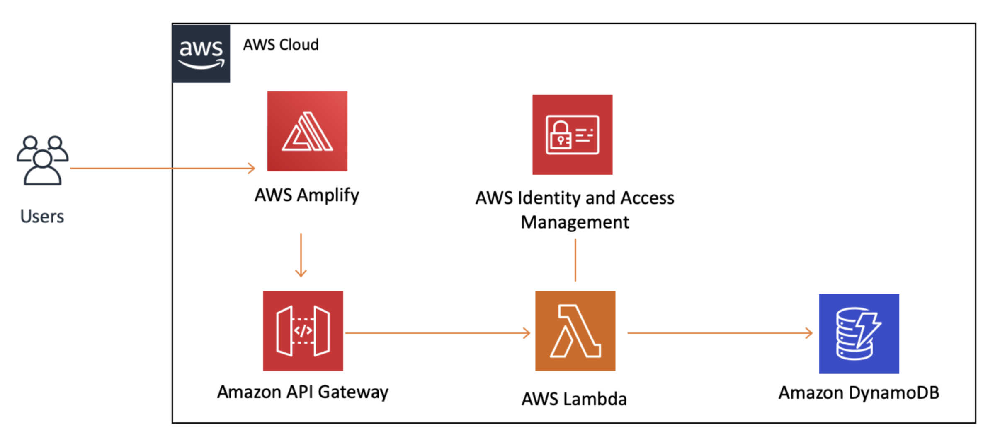

# Build a Basic Web Application

## Arcitecture

> 
>
#### Services

- **Amplify**: 
  - to deploy the static resources for your web application

- **API Gateway**
  - API Gateway will act as a middle layer between the HTML client we created in module one and the serverless backend

- **Lambda**
  - serverless backend

- **IAM**
- **DynamoDB**

### API Gateway Creation Options

- **HTTP API**
  - Build low-latency and cost-effective REST APIs with built-in features such as OIDC and OAuth2, and native CORS support.
- **WebSocket API**
  - Build a WebSocket API using persistent connections for real-time use cases such as chat applications or dashboards.
- **REST API**
  - Develop a REST API where you gain complete control over the request and response along with API management capabilities.
- **REST API (private)**
  - Create a REST API that is only accessible from within a VPC.

### API Gateway concepts

- **RESTful API** – REST stands for "Representational State Transfer" and is an architectural pattern for creating web services. API stands for "application programming interface." Thus, a RESTful API is one that implements the REST architectural pattern.

- **HTTP request methods** – HTTP methods are designed to enable communications between clients and servers. Methods, like GET or PUT defined by the HTTP protocol, are used to indicate what action to take on a resource.

- **CORS** – The CORS browser security feature uses HTTP headers to tell a browser to allow a given web application running at one origin (domain) to access selected resources from a server at a different origin.

- **Edge optimized** – A resource that uses AWS global infrastructure to better serve geographically diverse clients.

---

API Gateway Invoke url: https://qsj2o1p4hh.execute-api.us-west-2.amazonaws.com/dev

DynamoDB arn: arn:aws:dynamodb:us-west-2:516347559513:table/BLynchDatabase

---

## Link

- [AWS Lambda Getting Started](https://aws.amazon.com/lambda/getting-started/)
  - [Step 3: Build a Basic Web Application](https://aws.amazon.com/lambda/getting-started/)