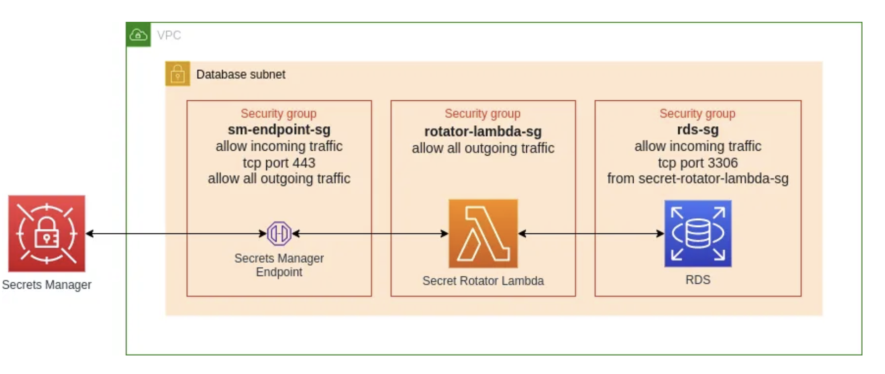
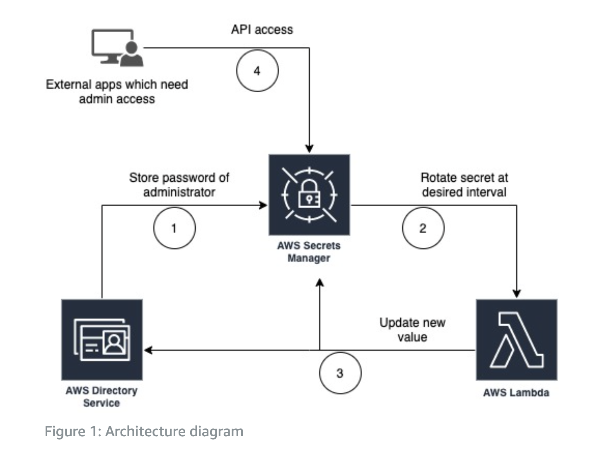
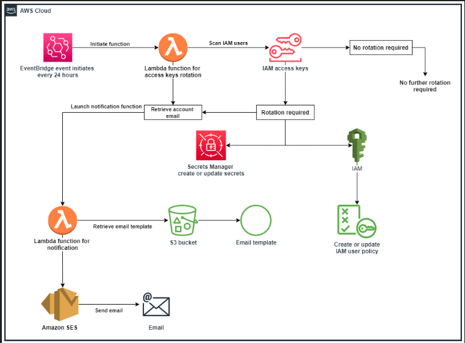
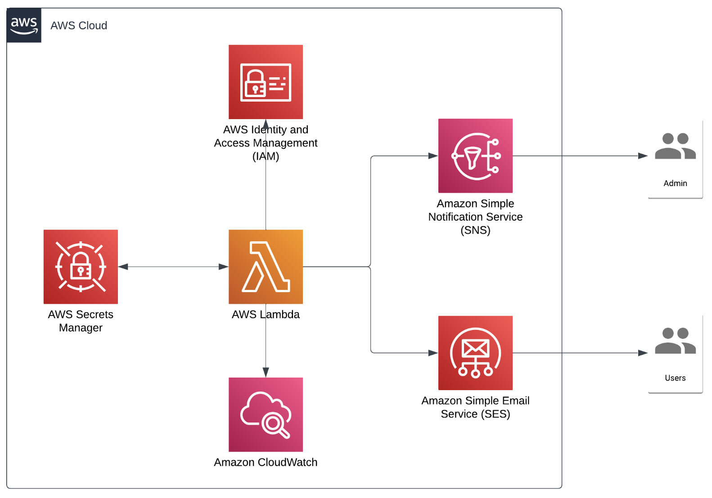

# AWS Secretes Manager

---

## Links

- #### Github: [aws-samples/aws-secrets-manager-rotation-lambdas](https://github.com/aws-samples/aws-secrets-manager-rotation-lambdas)

- #### Medium Blog: [Securing SSH Private Keys using AWS Secrets Manager](https://medium.com/@nilouferbustani/securing-ssh-private-keys-using-aws-secrets-manager-6d93537c1037)

- #### Medium Blog: [Achieving RDS password rotation with Secrets Manager](https://awstip.com/achieving-rds-password-rotation-with-secrets-manager-3444fa30c94b)

  > ###### Complete guide to enabling secure password management and automatic password rotation 
  >
  > ###### for RDS using AWS Secrets Manager and Terraform
  >
  >  

  

- ### AWS Docs: [Manage your AWS Directory Service credentials using AWS Secrets Manager](https://aws.amazon.com/blogs/security/manage-your-aws-directory-service-credentials-using-aws-secrets-manager/)

  >  

- #### Blog: [Automatically rotate IAM user access keys](https://samiulsaki.info/posts/post-11/) 

  >  

- #### Blog: [AWS Secrets Manager automatic rotation on IAM User Access Keys](https://jeremyritchie.com/posts/9/) 

  >  

