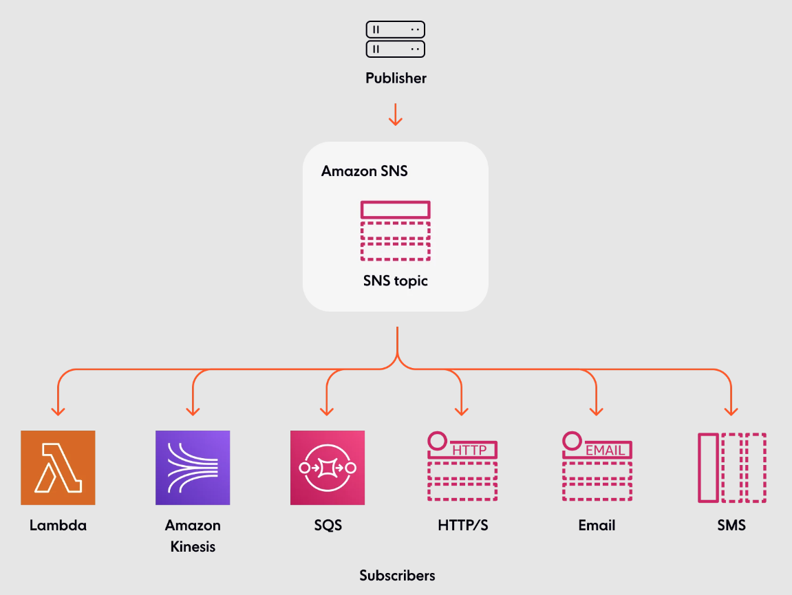

# SNS - Simple Notification Service

#### Links

- [boto3 SNS client](https://boto3.amazonaws.com/v1/documentation/api/latest/reference/services/sns.html)
- [Amazon SNS examples using SDK for Python (Boto3)](https://docs.aws.amazon.com/code-library/latest/ug/python_3_sns_code_examples.html)
- [aws cli - sns](https://awscli.amazonaws.com/v2/documentation/api/latest/reference/sns/index.html)
- [terraform - aws_sns_topic](https://registry.terraform.io/providers/hashicorp/aws/latest/docs/resources/sns_topic)

---

SNS is a distributed publish/subscribe solution used for app-to-app and app-to-person communication.

SNS can publish message to many different services by different means

>  

### [Permissions](https://docs.aws.amazon.com/sns/latest/dg/sns-access-policy-language-api-permissions-reference.html)

Amazon SNS supports the actions shown in the following table.

| Action                       | Description                                                  |
| :--------------------------- | :----------------------------------------------------------- |
| sns:AddPermission            | Grants permission to add permissions to the topic policy.    |
| sns:DeleteTopic              | Grants permission to delete a topic.                         |
| sns:GetDataProtectionPolicy  | Grants permission to retrieve a topic's data protection policy. |
| sns:GetTopicAttributes       | Grants permission to receive all of the topic attributes.    |
| sns:ListSubscriptionsByTopic | Grants permission to retrieve all the subscriptions to a specific topic. |
| sns:ListTagsForResource      | Grants permission to list all tags added to a specific topic. |
| sns:Publish                  | Grants permission to both publish and publish batch to a topic or endpoint. For more information, see [Publish](https://docs.aws.amazon.com/sns/latest/api/API_Publish.html) and [PublishBatch](https://docs.aws.amazon.com/sns/latest/api/API_BatchPublish.html) in the Amazon Simple Notification Service API Reference. |
| sns:PutDataProtectionPolicy  | Grants permission to set a topic's data protection policy.   |
| sns:RemovePermission         | Grants permission to remove any permissions in the topic policy. |
| sns:SetTopicAttributes       | Grants permission to set a topic's attributes.               |
| sns:Subscribe                | Grants permission to subscribe to a topic.                   |

 

### SNS Message Filtering

- JSON policy used to filter messages sent to SNS topics subscription

- If a subscrioption doesnt have a filtering policy, it recieves every message

- ```bash
                                                                                                 
                                                                            ┌───────────────────┐
                                                                            │     SQS Queue     │
                                                                 ╔═════════▶│  (Placed Orders)  │
                                                                 ║          └───────────────────┘
                                                                 ║                               
                                                            Filter                               
                                                            State: Placed                        
     ┌────────────────┐                   ┌───────────┐          ║          ┌───────────────────┐
     │                │                   │           │          ║          │     SQS Queue     │
     │ Buying Service │──────────────────▶│ SNS Topic │══════════╬─────────▶│(Cancelled Orders) │
     │                │  Order: 1234      │           │          ║          └───────────────────┘
     └────────────────┘  Product: Pencil  └───────────┘          ║                               
                         Oty: 4                                  ║                               
                         State: Placed                           ║                               
                                                                 ║          ┌───────────────────┐
                                                                 ║          │     SQS Queue     │
                                                                 ╚═════════▶│   (All Orders)    │
                                                                            └───────────────────┘
  ```

  


---

## AWS CLI

#### Create SNS topic

> ```bash
> aws sns create-topic --name new_topic
> ```

#### List topics

> ```bash
> aws sns list-topics
> ```

#### Subscribe to a topic

> ```bash
> # email
> aws sns subscribe \
> 	--topic-arn arn:aws:sns:us-east-1:000000000000:new_topic 
> 	--protocol email 
> 	--notification-endpoint test@email.com
> 
> ```

#### List existing subscribers to a topic

> ```
> aws sns list-subscriptions
> ```

#### Publish to topic

> ```bash
> aws sns publish \
> 	--topic-arn arn:aws:sns:us-east-1:000000000000:new_topic \
> 	--message 'Test Message'
> 
> ```


---

## Terraform

#### Create SNS topic

> ```json
> resource "aws_sns_topic" "topic" {
>   name = "topic-name
> }
> ```

#### Create SNS topic subscription to publish to SQS Queue

> ```python
> # get sqs object
> data "aws_sqs_queue" "queue" {
>   name = var.queue_name
> } 
> 
> resource "aws_sns_topic_subscription" "events" {
>   topic_arn = aws_sns_topic.topic.arn
>   protocol  = "sqs"
>   endpoint  = data.aws_sqs_queue.queue.arn
> }
> ```

