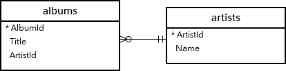

# SQLite

---

These are sample sql statements

SQL keywords

- collate nocase
- notnull vs not null

## [Data Types](https://www.sqlite.org/datatype3.html)

- **NULL**. The value is a NULL value.
- **INTEGER**. The value is a signed integer, stored in 1, 2, 3, 4, 6, or 8 bytes depending on the magnitude of the value.
- **REAL**. The value is a floating point value, stored as an 8-byte IEEE floating point number.
- **TEXT**. The value is a text string, stored using the database encoding (UTF-8, UTF-16BE or UTF-16LE).
- **BLOB**. The value is a blob of data, stored exactly as it was input.
-  


## SQLite CLI

### Setup

> ###### Open database
>
> ```bash
> sqlite3 <db-path>         # open database
> ```
>
> ###### Useful commands
>
> ```sqlite
> # show tables
> .tables.     
> 
> # tables structure
> .schema                 -- all tables
> .schema <table-name>    -- specified table
> 
> # styling
> .mode column
> .headers on
> .separator ROW "\n"
> .nullvalue NULL
> 
> # Create backup
> .backup table-backup
> 
> # Code to copy to create same database
> .dump
> 
> # view db encoding
> PRAGMA encoding;
> 
> .help         -- get general help
> .help .mode   -- get help for a command
> ```


## Table Creation and Modification

### Create Table

> ```sqlite
> -- create table: projects
> CREATE TABLE IF NOT EXISTS projects (
> 	id integer PRIMARY KEY,
> 	name text NOT NULL,
> 	begin_date text,
> 	end_date text
> );
> 
> -- create table with foreign key: tasks
> CREATE TABLE IF NOT EXISTS tasks (
> 	id integer PRIMARY KEY,
> 	name text NOT NULL,
> 	priority integer,
> 	project_id integer NOT NULL,
> 	status_id integer NOT NULL,
> 	begin_date text NOT NULL,
> 	end_date text NOT NULL,
> 	FOREIGN KEY (project_id) REFERENCES projects (id)
> );
> 
> -- Create a table with column constraints
> CREATE TABLE parts ( 
>   part_id  INTEGER  PRIMARY KEY,
>   stock    INTEGER  DEFAULT 0  NOT NULL,
>   desc     TEXT     CHECK( desc != '' ) -- empty strings not allowed
> );
> 
> -- Create a table with compound constraints
> CREATE TABLE rooms (
>   room_number      INTEGER  NOT NULL,
>   building_number  INTEGER  NOT NULL
>   PRIMARY KEY(room_number, building_number) -- compond primary key
> );
> ```
>

### Alter Table

> ###### Add Column
>
> ```sqlite
> ALTER TABLE {table_name} ADD {new_column_name} {col_type};
> ```
>
> ###### Rename Column
>
> ```sqlite
> -- version 3.25.0 or greater
> ALTER TABLE table_name
> RENAME COLUMN current_name TO new_name;
> ```
>
> ###### Delete Column
>
> - rename the existing table
> - create a new table under the original name
> - copy data from old table to new table
>
> 

### Delete Table

> ```sqlite
> -- Delete table
> DROP TABLE IF EXISTS "table_name";
> ```


## Modifying Table Data

---

### Insert Data

> ```sqlite
> -- specify column names
> INSERT INTO contacts (name, phone, email) 
> 	VALUES ('Brian', 34567, 'hi@updock.com');
> 
> INSERT INTO students 
> 	VALUES(12, 'Aly', 4, '1996-10-12');
> ```

### Update

> ```sqlite
> -- Update data for all rows
> UPDATE contacts 
> 	SET email="brian@gmail.com";
> 
> -- Update data for specific rows
> UPDATE contacts 
> 	SET email="brian@gmail.com" 
> 	WHERE name = "Brian";
> ```

### Delete

> ```sqlite
> DELETE FROM Students 
> 	WHERE StudentId = 11 OR StudentId = 12;
> 
> DELETE FROM songs 
> 	WHERE track < 50;
> ```


## Quey Data

---

#### SELECT

> ```sqlite
> -- view all column 
> SELECT * FROM artists;
> 
> -- view specific columns
> SELECT name FROM artists;
> ```

#### WHERE

> ```sqlite
> SELECT * FROM contacts 
> 	WHERE name="U2";
> ```

#### ORDER

> ```sqlite
> -- order by 
> SELECT * FROM artists 
> 	ORDER BY name;
> 
> -- case-insensitive order by using COLLATE NOCASE
> SELECT * FROM albums 
> 	ORDER BY name COLLATE NOCASE;
> 
> -- order by descending using DES
> SELECT * FROM albums 
> 	ORDER BY name COLLATE NOCASE DESC;
> 
> -- Order albums by artist, and then or by name
> SELECT * FROM albums 
> 	ORDER BY artist, name COLLATE NOCASE;
> ```

#### JOIN

> ```sqlite
> -- simple join
> SELECT * FROM songs JOIN albums ON songs.album = albums._id
> 
> SELECT songs.track, songs.title, albums.name FROM songs INNER JOIN albums ON albums._id=songs.album;
> 
> -- complex join
> SELECT Tracks.Name as Track, Title as Album, Artists.Name as Artist from Tracks
> 	JOIN Albums ON Tracks.AlbumId = Albums.AlbumId
> 	JOIN Artists ON Albums.ArtistId = Artists.ArtistId
> 	WHERE Artist = "U2" AND Track = "Pride (In The Name Of Love)";
> ```

#### WILDCARD

> ```sqlite
> -- Get all songs that have the word doctor in the name using WHERE LIKE
> SELECT artists.name, albums.name, songs.track, songs.title FROM songs
>    INNER JOIN albums ON songs.album=albums._id
>    INNER JOIN artists ON artists._id=albums.artist
>    WHERE artists.name LIKE "jefferson%"
>    ORDER BY artists.name, albums.name, songs.track;
> 
> 
> --Get all songs that have the word jefferson at the start of their name
> SELECT artists.name, albums.name, songs.track, songs.title FROM songs
>    INNER JOIN albums ON songs.album=albums._id
>    INNER JOIN artists ON artists._id=albums.artist
>    WHERE artists.name LIKE "jefferson%"
>    ORDER BY artists.name, albums.name, songs.track;
> ```

#### NOT EQUAL

> ```sqlite
> -- track number is not 71 using the not equal sign <>
> SELECT * FROM songs 
> 	WHERE track <> 71;
> ```


## JOINS

---

### Table Joins

 

- CROSS JOIN   -  has the potential to generate extremely large tables
- INNER JOIN    -  most common type of join
- NATURAL JOIN -  auto check for matching columns 
- OUTER JOIN   -  SQLite only has left outer join, often used to find ‘dangling rows’

 

#### [INNER JOIN](https://www.sqlitetutorial.net/sqlite-inner-join/)

> ```sqlite
> -- get artist name and album name, by joining artists and album table
> SELECT Title, Name FROM albums
> INNER JOIN artists 
>     ON artists.ArtistId = albums.ArtistId;
> 
> -- do same using table aliases to shorten the query
> SELECT l.Title, r.Name
> FROM albums l
> INNER JOIN artists r ON
>     r.ArtistId = l.ArtistId;
> 
> -- USING(ArtistId) is equipvalent to the clause ON artists.ArtistId = albums.ArtistId
> SELECT Title, Name
> FROM albums
> INNER JOIN artists USING(ArtistId);
> ```

#### [LEFT JOIN](https://www.sqlitetutorial.net/sqlite-left-join/)

> ###### Get artist names and album titles
>
> - The left join returns all rows from the artists table (or left table) and 
>   the matching rows from the albums table (or right table)
> - If a row from the left table doesn’t have a matching row in the right table, 
>   SQLite includes columns of the rows in the left table and `NULL` for the columns of the right table.
>
> ```sqlite
> SELECT Name, Title
> FROM artists
> LEFT JOIN albums ON
>     artists.ArtistId = albums.ArtistId
> ORDER BY Name;
> 
> -- same query with the 'USING' syntax
> SELECT Name, Title
> FROM artists
> LEFT JOIN albums USING (ArtistId)
> ORDER BY Name;
> ```
>
> - Results: can see artists without albums included
>   
>
> ###### find artists who don’t have any albums
>
> ```sqlite
> SELECT Name, Title
> FROM artists
> LEFT JOIN albums ON
>     artists.ArtistId = albums.ArtistId
> WHERE Title IS NULL   
> ORDER BY Name;
> 
> ```
>
> - Results
>   

#### [CROSS JOIN](https://www.sqlitetutorial.net/sqlite-cross-join/)

> ```sqlite
> SELECT select_list
> FROM table1
> CROSS JOIN table2;
> ```

#### [FULL OUTER JOIN](https://www.sqlitetutorial.net/sqlite-full-outer-join/)

> 

## AGGREGATION

> ```sql
> SELECT count(*) FROM songs;
> 
> SELECT min(Price) FROM houses;
> SELECT max(Price) FROM houses;
> SELECT avg(Price) FROM houses;
> SELECT sum(Price) FROM houses;
> ```

---

### Tools

- DB Browser for SQLite

  ```bash
  # open new instance of app
  open -n -a "DB Browser for SQLite"
  ```

  

## Useful Links

#### Doumentatinon

> - [Official Documentation](https://www.sqlite.org/docs.html)
> - [SQLite Tutorial Website](https://www.sqlitetutorial.net/)
> - [How To Use The SQLite Dump Command](https://www.sqlitetutorial.net/sqlite-dump/)

#### Stackoverflow 

> - [How to recover a corrupt SQLite3 database?](https://stackoverflow.com/questions/18259692/how-to-recover-a-corrupt-sqlite3-database/18260642)
> - [Update column with a value from another table](https://stackoverflow.com/questions/28668817/update-column-with-value-from-another-table-using-sqlite)
> - 

