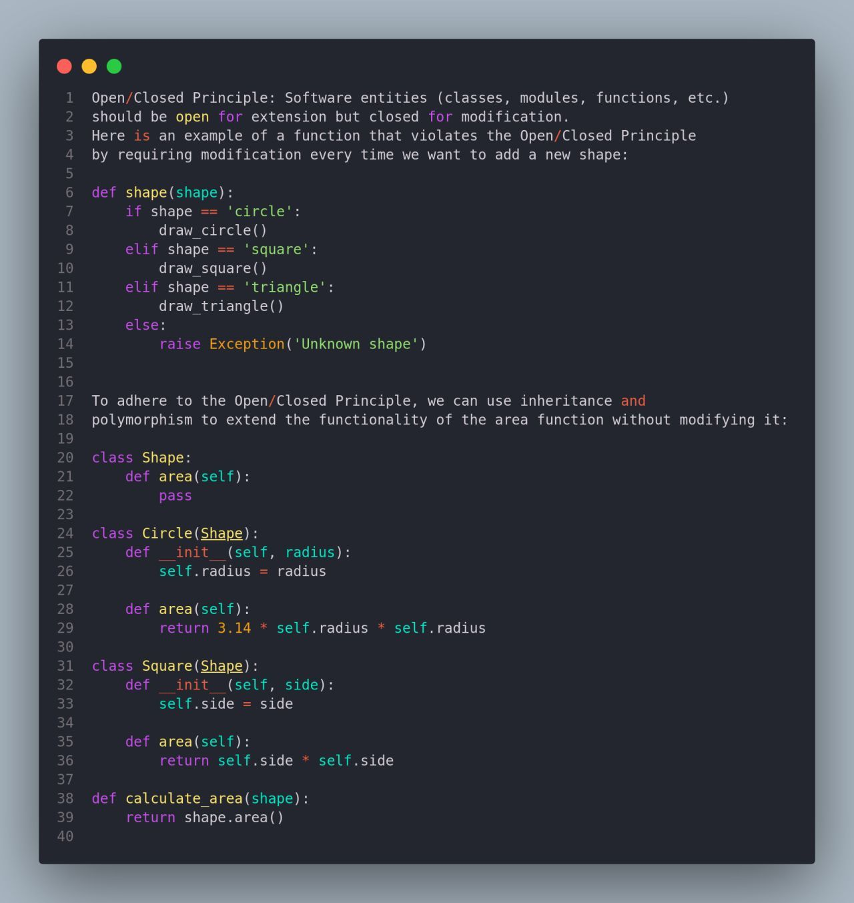
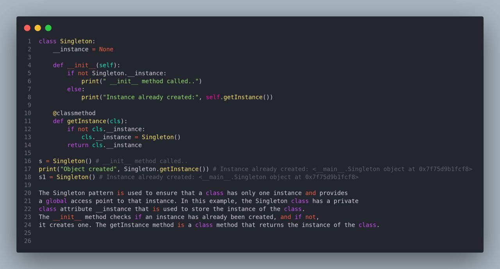

# Definitions


###### first class function

>  function can be passed as an arguement to another function
>
> ```python
> def square(x): return x * x
> 
> def print_result(x, func):
>     """recieve a function and execute it and return result"""
>     return func(x)
> 
> do_square = square     # assigning square function to a variable
> 
> res = print_result(5, do_square)   # passing function to another function
> ```

### OOP - Object orientated programming

###### inheritance

> Inheritance allows us to inherit attributes and methods from a parent class
>
> We can then overwrite or add new functionality without affecting the parent class
>

###### dependency injection


###### Open/Closed Principal

>  

###### Singleton

>  


## Deployments

#### [Deployment Approaches](https://docs.aws.amazon.com/wellarchitected/latest/serverless-applications-lens/deployment-approaches.html#bluegreen-deployments)

> All-at-once deployments
>
> Blue/green deployments
>
> Canary deployments

