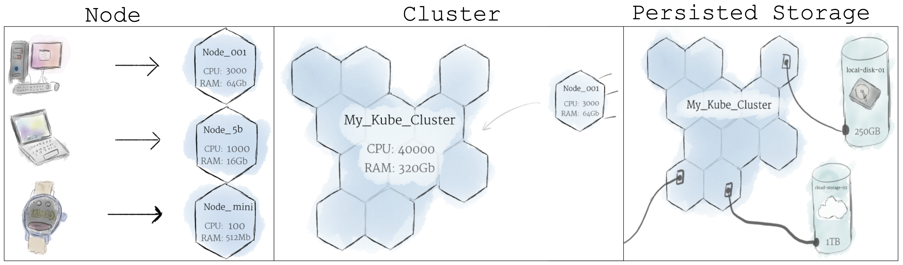
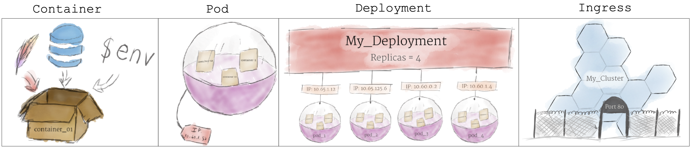

# kubernetes

Install

> ```
> brew install kubectl
> ```

### Kubernetes 101: Pods, Nodes, Containers, and Clusters

> ### Hardware
>
> 
>
> > ###### Node
> >
> > A [node](https://kubernetes.io/docs/concepts/architecture/nodes/) is the smallest unit of computing hardware in Kubernetes.
> > It is a representation of a single machine in your cluster
>
> > ###### Cluster (Collection of Nodes)
> >
> > Collection of nodes pooled together to form a more powerful machine
>
> > ###### Persistenr Volumes
> >
> > Because programs running on your cluster aren’t guaranteed to run on a specific node, data can’t be saved to any arbitrary place in the file system
> > To store data permanently, Kubernetes uses [Persistent Volumes](https://kubernetes.io/docs/concepts/storage/persistent-volumes/)
> > Persistent Volumes provide a file system that can be mounted to the cluster, without being associated with any particular node.
>
> ### Software
>
> 
>
> > ##### Containers
> >
> > Programs running on Kubernetes are packaged as [Linux containers](https://www.docker.com/what-container)
>
> > ##### Pods
> >
> > Collection of containers
> > Any containers in the same pod will share the same resources and local network, allowing easy communicatoin
> > Pods are used as the unit of replication in Kubernetes. If your application becomes too popular and a single pod instance can’t carry the load, Kubernetes can be configured to deploy new replicas of your pod to the cluster as necessary 
>
> > ###### Namespace
> >
> > A namespace is a way to isolate, group, and organize resources within a Kubernetes cluster.
>
> > ##### Deployments
> >
> > A deployment’s primary purpose is to declare how many replicas of a pod should be running at a time
> > It manages spinning up and taking down pods
>
> > ##### Ingress
> >
> > A channel for communicating with a service runnig within a pod
> > The most common ways to add Ingress to a cluster are by adding either an [Ingress](https://kubernetes.io/docs/concepts/services-networking/ingress/) controller, or a [LoadBalancer](https://kubernetes.io/docs/tasks/access-application-cluster/create-external-load-balancer/).


Commands

> ```bash
> kubectl get nodes
> 
> kubectl get deployments -A
> 
> kubectl get services                # List all services in the namespace
> kubectl get services -A             # List all services in all namespaces
> kubectl get namespaces
> kubectl get pods                    # List all pods in the namespace
> kubectl get pods --all-namespaces   # List all pods in all namespaces
> kubectl get pods -A --field-selector=status.phase=Running
> kubectl get pods --show-labels
> kubectl get pod <my-pod>
> kubectl get pods -A --sort-by=.status.startTime | grep NAME
> kubectl get events -A | grep Warning
> kubectl get --help
> 	-A, --all-namespaces
> 	-o, --output
> 		-o wide
> --sort-by
> 
> kubectl describe all-namespaces
> kubectl describe nodes
> 
> # View Logs
> 
> kubectl exec -it -n $namespace $pod -- bash
> -c, --container=''    Container name. If omitted, use the kubectl.kubernetes.io/default-container annotation for selecting the
>                     container to be attached or the first container in the pod will be chosen
> -f, --filename=[]     to use to exec into the resource
> -q, --quiet=false     Only print output from the remote session
> -i, --stdin=false     Pass stdin to the container
> -t, --tty=false       Stdin is a TTY
> ```
>


## kubectl commands

> ###### Viewing Resources
>
> ```bash
> # Get commands with basic output
> kubectl get services                 # List all services in the namespace
> kubectl get deployment my-dep        # List a particular deployment
> kubectl get pods --all-namespaces    # List all pods in all namespaces
> kubectl get pods -o wide             # List all pods in the current namespace, with more details
> kubectl get pods                     # List all pods in the namespace
> kubectl get pods --show-labels       # Show labels for all pods
> kubectl get pods -o json | jq -c 'paths|join(".")' # Period-delimited tree of all keys returned for pods, etc
> kubectl get pod my-pod -o yaml       # Get a pod's YAML
> 
> # Describe commands with verbose output
> kubectl describe nodes my-node
> kubectl describe pods my-pod
> 
> # List pods Sorted by Restart Count
> kubectl get pods --sort-by='.status.containerStatuses[0].restartCount'
> 
> # List Services Sorted by Name
> kubectl get services --sort-by=.metadata.name
> 
> # List all Secrets currently in use by a pod
> kubectl get pods -o json | jq '.items[].spec.containers[].env[]?.valueFrom.secretKeyRef.name' | grep -v null | sort | uniq
> 
> # List Events sorted by timestamp
> kubectl get events --sort-by=.metadata.creationTimestamp
> kubectl events --types=Warning    # List all warning events
> ```
>
> ###### Interacting with running Pods
>
> ```bash
> # logs
> kubectl logs my-pod
> kubectl logs my-pod --since 2h
> kubectl logs my-pod --previous
> kubectl logs my-pod --follow
> 
> # shell
> kubectl exec my-pod -- ls /
> kubectl exec --stdin --tty my-pod -- /bin/sh   # Interactive shell access to a running pod
> kubectl exec -it my-pod
> kubectl exec -it my-pod -- bin/bash -c 'cd /src && python /src/tracevector/manage.py shell'
> 
> # to be investigated
> kubectl attach my-pod -i               # Attach to Running Container
> kubectl port-forward my-pod 5000:6000  # Listen on port 5000 on the local machine and forward to port 6000 on my-pod
> ```
>

---

## Links

- **[Kubernetes 101: Pods, Nodes, Containers, and Clusters](https://medium.com/google-cloud/kubernetes-101-pods-nodes-containers-and-clusters-c1509e409e16)** - medium blog