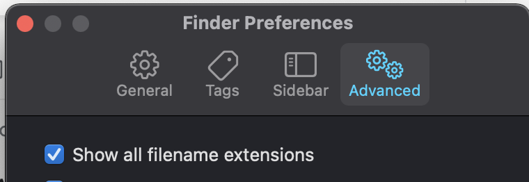

# Mac Setup 

### Homebrew

```bash
# homebrew: https://brew.sh
/bin/bash -c "$(curl -fsSL https://raw.githubusercontent.com/Homebrew/install/HEAD/install.sh)"

# create ~/.zshrc
touch ~/.zshrc

# python
# https://opensource.com/article/19/5/python-3-default-mac
brew install pyenv
pyenv install 3.9.5

# nodejs
# https://blog.jamesauble.com/install-nvm-on-mac-with-brew-adb921fb92cc
# https://www.newline.co/@Adele/how-to-install-nodejs-and-npm-on-macos--22782681
brew install nvm

# added the following to ~/.zshrc 
export NVM_DIR=~/.nvm
source $(brew --prefix nvm)/nvm.sh

# terraform
brew install tfenv
tfenv install 1.1.9
tfenv use 1.1.9

# install software
brew install coreutils
brew install ipython
brew install jq
brew install pre-commit
brew install tree

brew install --cask db-browser-for-sqlite
brew install --cask flux
brew install --cask inkscape
brew install --cask iterm2
brew install --cask nosql-workbench
brew install --cask postman
brew install --cask spotify
brew install --cask typora
brew install --cask visual-studio-code

# install oh-my-zsh
sh -c "$(curl -fsSL https://raw.github.com/ohmyzsh/ohmyzsh/master/tools/install.sh)"

# install antigen
-- https://youtu.be/ZUhAgJPlzvg?list=LL&t=135
-- https://github.com/zsh-users/antigen
brew install antigen
```

#### .zshrc

```bash
# Enable Powerlevel10k instant prompt. Should stay close to the top of ~/.zshrc.
# Initialization code that may require console input (password prompts, [y/n]
# confirmations, etc.) must go above this block; everything else may go below.
if [[ -r "${XDG_CACHE_HOME:-$HOME/.cache}/p10k-instant-prompt-${(%):-%n}.zsh" ]]; then
  source "${XDG_CACHE_HOME:-$HOME/.cache}/p10k-instant-prompt-${(%):-%n}.zsh"
fi

# 
if command -v pyenv 1>/dev/null 2>&1; then
  eval "$(pyenv init -)"
fi

# Path to your oh-my-zsh installation.
export ZSH="$HOME/.oh-my-zsh"

# ZSH_THEME="robbyrussell"

# plugins=(git)
ZSH_DISABLE_COMPFIX="true"
source $ZSH/oh-my-zsh.sh

# antigen
source /usr/local/share/antigen/antigen.zsh
# load the oh-my-zsh library
antigen use oh-my-zsh
# add plugins:                              https://github.com/ohmyzsh/ohmyzsh/tree/master/plugins
antigen bundle git  # git autocompletions:  https://github.com/ohmyzsh/ohmyzsh/tree/master/plugins/git
antigen bundle pip  # pip autocompletions   https://github.com/ohmyzsh/ohmyzsh/tree/master/plugins/pip
antigen bundle z    # z - jump around:      https://github.com/ohmyzsh/ohmyzsh/tree/master/plugins/z
antigen bundle colored-man-pages
# zsh-users bundles
antigen bundle zsh-users/zsh-syntax-highlighting
antigen bundle zsh-users/zsh-completions
antigen bundle zsh-users/zsh-autosuggestions
# add a theme
antigen theme romkatv/powerlevel10k

antigen apply

### Fix slowness of pastes with zsh-syntax-highlighting.zsh
pasteinit() {
  OLD_SELF_INSERT=${${(s.:.)widgets[self-insert]}[2,3]}
  zle -N self-insert url-quote-magic # I wonder if you'd need `.url-quote-magic`?
}
pastefinish() {
  zle -N self-insert $OLD_SELF_INSERT
}
zstyle :bracketed-paste-magic paste-init pasteinit
zstyle :bracketed-paste-magic paste-finish pastefinish
### Fix slowness of pastes

# To customize prompt, run `p10k configure` or edit ~/.p10k.zsh.
[[ ! -f ~/.p10k.zsh ]] || source ~/.p10k.zsh

eval "$(pyenv init --path)"

alias brian="~/cheatsheet"
alias typora="open -a typora"
```

### .zprofile

```bash
eval "$(pyenv init --path)"

alias aws-local="aws --endpoint-url http://localhost:4566 --profile localstack"
alias check-localstack="curl http://localhost:4566/health | jq"
```

### Mac Settings

- Show file extensions
  Finder/Preferences/Advanced
    


### Set up iTerm2

Add key binding to open iTerm

- System Preferences/Keyboard/

  

```bash
# iTerm2
-- terminal alternative for mac
-- https://youtu.be/tMNOpaQrfAE?t=711
-- natural text editing: https://youtu.be/tMNOpaQrfAE?t=828
-- previous sessions dir: https://youtu.be/tMNOpaQrfAE?t=885
```

#### VSCode Extensions

```bash
code --list-extensions

albert.TabOut
amazonwebservices.aws-toolkit-vscode
christian-kohler.npm-intellisense
christian-kohler.path-intellisense
CoenraadS.bracket-pair-colorizer
dbaeumer.vscode-eslint
eamodio.gitlens
esbenp.prettier-vscode
formulahendry.code-runner
graykode.ai-docstring
Gruntfuggly.todo-tree
hashicorp.terraform
k--kato.intellij-idea-keybindings
ms-azuretools.vscode-docker
ms-python.python
ms-python.vscode-pylance
ms-toolsai.jupyter
ms-toolsai.jupyter-keymap
ms-toolsai.jupyter-renderers
ms-vscode-remote.remote-containers
rangav.vscode-thunder-client
sandcastle.vscode-open
shd101wyy.markdown-preview-enhanced
TabNine.tabnine-vscode
techer.open-in-browser
```

#### VSCode Terminal

```bash
# followed this article to update vscode terminal
https://youngstone89.medium.com/how-to-change-font-for-terminal-in-visual-studio-code-c3305fe6d4c2

# updated vscode keybindings
--https://superuser.com/a/1343695

-- settings
---- appearence/general/theme            => minimal
---- profiles/general/working directory  => reuse previous sessions directory
---- profiles/keys/Presets..             => natural text editing
```

### Typora

```bash
# set theme to night 
-- Typora -> Preferences -> Appearence -> Themes -> Theme

# open typora css
code ~/Library/Application\ Support/abnerworks.Typora
touch ~/Library/Application\ Support/abnerworks.Typora/themes/base.user.css
```

 

```css
/*  base.user.css */

#write {
  max-width: calc(100% - 100px);
  /* background-color: #2b7a4a; */
}

@media only screen and (min-width: 1400px) {
	#write {
		max-width: calc(100% - 100px);
    /* background-color: #c4a641; */
	}
}

@media only screen and (min-width: 1800px) {
	#write {
		max-width: calc(100% - 100px);
    /* background-color: #4183C4; */
	}
}
```
