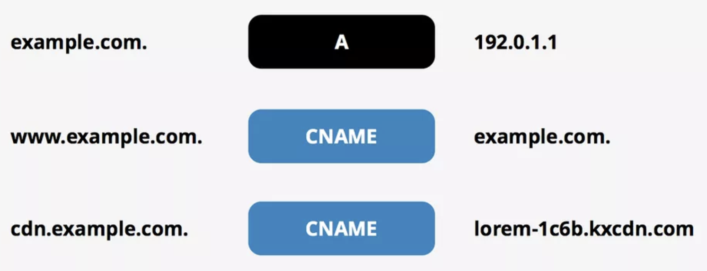
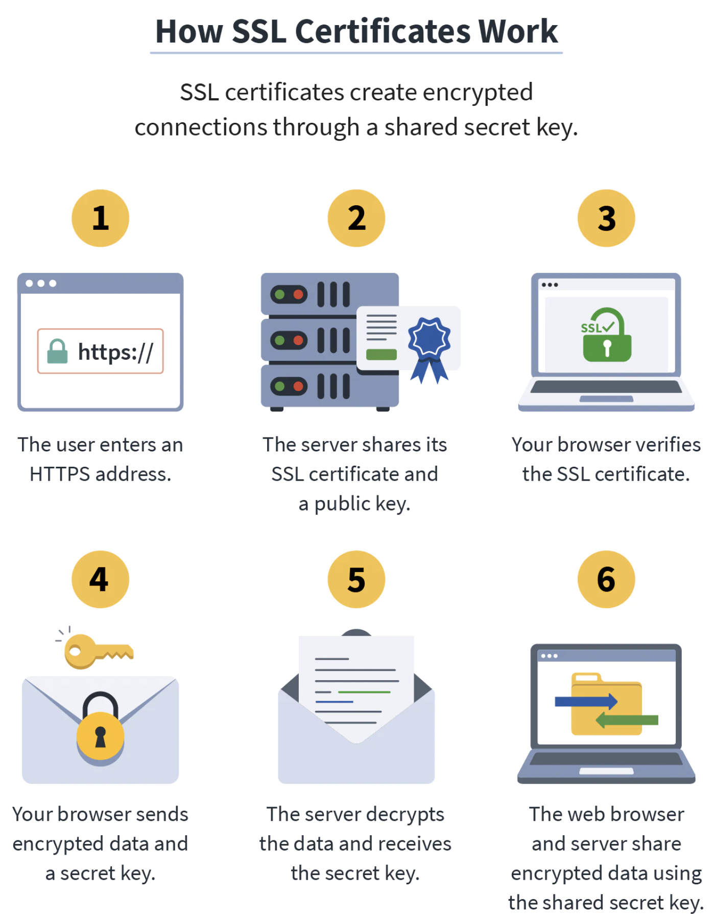
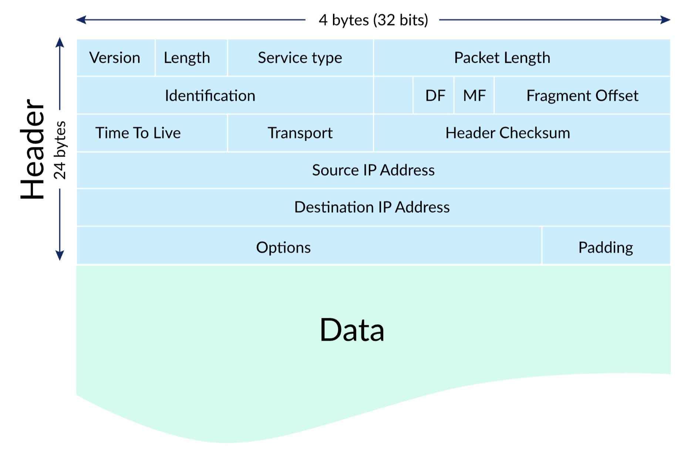
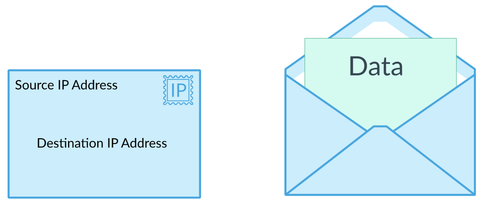

# Networking

## DNS

> The **Domain Name System** (DNS) is the phonebook of the Internet. 
> Humans access information online through domain names, like nytimes.com or espn.com. 
> Web browsers interact through Internet Protocol (IP) addresses. 
> **DNS translates domain names to IP addresses** so browsers can load Internet resources.

## Record Types

### A and CNAME Recods

>  
>
> **A record** ("address record") - maps a domain name to an IP address
>
> **CNAME record** - map from one domain name to another

 

## SSL Cetificate

>  

### What is SSL (Secure Sockets Layer)

> SSL, more **commonly called TLS**, 
> **a protocol for encrypting Internet traffic and verifying server identity**. 
> Any website with an HTTPS web address uses SSL/TLS. 
> See [What is SSL](https://www.cloudflare.com/learning/ssl/what-is-ssl/)? and [What is TLS](https://www.cloudflare.com/learning/ssl/transport-layer-security-tls/)? to learn more.

### What is a SSL Certificate

> - SSL certificates are what enable websites to move from [HTTP](https://www.cloudflare.com/learning/ddos/glossary/hypertext-transfer-protocol-http/) to [HTTPS](https://www.cloudflare.com/learning/ssl/what-is-https/), which is more secure. 
> - An SSL certificate is **a data file hosted in a website's [origin server](https://www.cloudflare.com/learning/cdn/glossary/origin-server/)**. 
> - SSL certificates make [SSL/TLS encryption](https://www.cloudflare.com/learning/ssl/what-is-ssl/) possible, and they contain the website's [public key](https://www.cloudflare.com/learning/ssl/how-does-public-key-encryption-work/) and the website's identity, along with related information. 
> - Devices attempting to communicate with the origin server will reference this file to obtain the public key and verify the server's identity. 
>   The private key is kept secret and secure.

### What does a SSL Cert Contain

> - The [domain name](https://www.cloudflare.com/learning/dns/glossary/what-is-a-domain-name/) that the certificate was issued for
> - Which person, organization, or device it was issued to
> - Which certificate authority issued it
> - The certificate authority's digital signature
> - Associated subdomains
> - Issue date of the certificate
> - Expiration date of the certificate
> - The public key (the private key is kept secret)
>
> The public and private keys used for SSL are essentially long strings of characters used for encrypting and signing data. 
> Data encrypted with the public key can only be decrypted with the private key.

## Proxy, Forward Proxy

### Examples

> 1. **VPN Saaa** - Nord VPN

### Use Cases

> 1. **Caching** - A very popular use case of proxy server. It saves bandwidth by caching the content and serving it back to the client instead of going to the internet everytime.
> 2. **Anonymity** - Proxy talks to the server so the final destination (server) does not know from where the request is actually coming from.
> 3. **Security** - It acts as a firewall. Multiple client machines can talk to a centralised proxy server. It helps organisations and ISPs, block or filter the bad requests which could impact client machines sitting inside the network.
> 4. **Encryption & Decryption** - Proxy can encrypt and hide (mask) IP address and sensitive data going through the request. It only sends it in a way where you can not be discovered back.
> 5. **Logging** - Logging can help caching the pages which are being visited often.
> 6. **Microservices** - This is one of the latest and very interesting use case of proxy. There are several types of proxy such as sidecar proxy, HTTP proxy, TCP proxy etc. We can deploy proxy next to our application and it can take care of all the networking stuff.
> 7. Bypass IP Ban

## Reverse Proxy

### Advantages of Reverse Proxy server

> 1. **Load balancing** - Reverse proxy helps balancing the load among the servers. Along with it, reverse proxy helps us compress (zipping) the request size which helps in increase of overall performance.
> 2. **Ingress** - In kubernetes and microservice architecture, based on the request it funnels the request to the particular service. (eg. If requests comes for picture API, it takes the request to the respective service. Here it kinds of work as a router)
> 3. **Canary Deployment** - Suppose, Youtube wants to experiment for 10% of requests to have a random generated thumbnail. This can be done by reverse proxy.

> ###### Anology
>
> 

> Reverse proxy solves the issue of having just 1 public IP, with many services behind it that want to internally run on the same port. Or the issue of services internally running on various machines that all share the same public IP. And adds some minor additional security.
>
> You have a public ip listening on 80/443, that connects to a reverse proxy you have running. The proxy is listening for what actual address is the request targeted at and forwards it where it needs to go. So you have have a single machine running services on 50 different ports and the proxy points the right request at the right internal port. Or you have 10 virtual machines internally running the services and the proxy points the request in the right direction.
>
> Reverse proxy is also the perfect place to centralize automatic certificate renewal for all of your services.

## IP Packets 

>  
>
> ###### What are they
>
> A piece of a message sent over the internet
>
> ###### Contain?
>
> - **Header**
>   - includes the IP addresses of the source and destination, plus other fields that help to route the packet
> - **Data / Payload**
>   - the actual content, such as a string of letters or part of a webpage.
>
> ###### Anology
>
> -  IP packets are like postal letters: 	
>   - the header is the envelope with all the routing information that's needed by the post office,
>   -  the payload is the letter that's read only by the recipient.
>     

---

## Links

###### DNS

- [DNS for beginers: how to give your site a domain name](https://mattsegal.dev/dns-for-noobs.html)

###### IP Packets

- [User Datagram Protocol (UDP)](https://www.khanacademy.org/computing/computers-and-internet/xcae6f4a7ff015e7d:the-internet/xcae6f4a7ff015e7d:transporting-packets/a/user-datagram-protocol-udp)
- [Transmission Control Protocol (TCP)](https://www.khanacademy.org/computing/computers-and-internet/xcae6f4a7ff015e7d:the-internet/xcae6f4a7ff015e7d:transporting-packets/a/transmission-control-protocol--tcp)