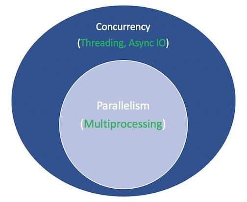
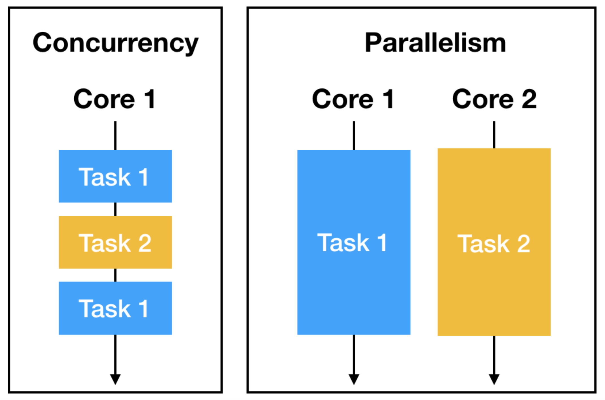
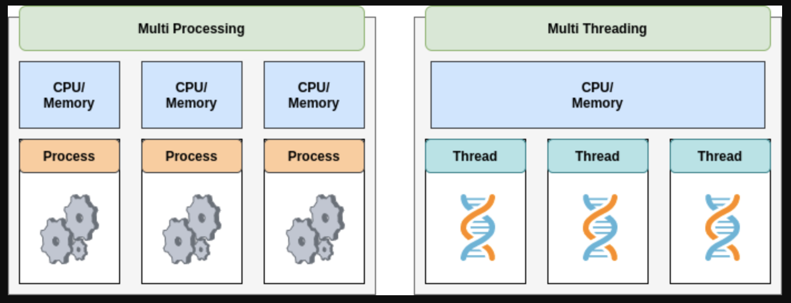

# Asyncio

## Asynchronous IO (async IO)

- a language-agnostic paradigm (model) that has implementations across a host of programming languages
- Async IO is a bit **lesser known** than its tried-and-true cousins, **multiprocessing and [threading](https://realpython.com/intro-to-python-threading/).** 

## Preface: Concurrency and Parallelism

>  
>
> The white terms represent concepts, and the green terms represent ways in which they are implemented or effected:

**Parallelism** consists of performing multiple operations at the same time. 

**Multiprocessing** is a means to effect parallelism, and it entails spreading tasks over a computer’s central processing units (CPUs, or cores). 
Multiprocessing is well-suited for CPU-bound tasks: tightly bound [`for` loops](https://realpython.com/python-for-loop/) and mathematical computations usually fall into this category.
Multiprocessing is a form of parallelism, with parallelism being a specific type (subset) of concurrency

**Concurrency**
Concurrency refers to the ability of an application to handle multiple tasks concurrently. 
Rather than executing tasks in a strictly sequential manner, concurrency allows for overlapping and interleaving of tasks. 
By utilizing context switching, the application can switch rapidly between different tasks, giving the impression of parallel execution.

**Threading** 
Concurrent execution model whereby multiple [threads](https://en.wikipedia.org/wiki/Thread_(computing)) take turns executing tasks. 
One process can contain multiple threads. Python has a complicated relationship with threading thanks to its [GIL](https://realpython.com/python-gil/), but that’s beyond the scope of this article.
Threading is that it’s better for IO-bound tasks

 

**async IO**
async IO is not threading, nor is it multiprocessing. It is not built on top of either of these.
async IO is a single-threaded, single-process design: it uses **cooperative multitasking**
It gives a feeling of concurrency despite using a single thread in a single process.

## Async IO Anology: Chess master exebition

> Chess master Judit Polgár hosts a chess exhibition in which she plays multiple amateur players. 
> She has two ways of conducting the exhibition: synchronously and asynchronously.
>
> Assumptions:
>
> - **24 opponents**
> - **Judit** makes each chess move in **5 seconds**
> - **Opponents** each take **55 seconds** to make a move
> - Games average **30 pair-moves** (60 moves total)
>
> **Synchronous version**: 
> Judit plays one game at a time, never two at the same time, until the game is complete. 
> Each game takes *(55 + 5) \* 30 == 1800* seconds, or 30 minutes. 
> The entire exhibition takes *24 \* 30 == 720* minutes, or **12 hours**.
>
> **Asynchronous version**: 
> Judit moves from table to table, making one move at each table. 
> She leaves the table and lets the opponent make their next move during the wait time. 
> One move on all 24 games takes Judit *24 \* 5 == 120* seconds, or 2 minutes. 
> The entire exhibition is now cut down to *120 \* 30 == 3600* seconds, or just **1 hour**. 
>  
>
> [(*Source*)](https://youtu.be/iG6fr81xHKA?t=4m29s)

Async IO takes long waiting periods in which functions would otherwise be blocking and allows other functions to run during that downtime.


---

## Python packake `asyncio`

- [vscode://file//Users/brianlynch/Desktop/date-dump/240718_try-asyncio-fastapi/FastApi-Async-Practices/bin/countasync.py](vscode://file//Users/brianlynch/Desktop/date-dump/240718_try-asyncio-fastapi/FastApi-Async-Practices/bin/countasync.py)
- `asyncio` is a fundamental **library** that empowers you to write **concurrent code** using the `async/await` syntax.
- **well-suited for application**s that involve a **significant amount of waiting** for I/O (input/output) operations, 
  - e.g network requests, file system access, or user input.

### **Traditional Multithreading vs. Asyncio**

> #### **Multithreading**
>
> - allows for **executing multiple tasks concurrently**
> - can introduce complexity due to the Global Interpreter Lock
> - GIL restricts multiple threads from executing Python bytecode simultaneously, potentially negating the benefits of multithreading in I/O-bound scenarios
>
> ##### **Asyncio**
>
> - **more efficient alternative f**or I/O-heavy tasks
> - employs a **single thread** that **rapidly switches between coroutines** (asynchronous functions) as they await I/O completion
> - This event-driven approach avoids the overhead associated with thread creation and context switching,

### Example

> ```bash
> pip install aiohttp
> ```
>
> - The aiohttp code **fetches data from an API asynchronously**
> - defines an `async` function `fetch_data` that makes a GET request and parses the JSON response
> - The `main` function calls `fetch_data` asynchronously and prints the retrieved data.
> - This approach keeps your program responsive while waiting for the API response.
>
> ```python
> import asyncio
> import aiohttp
> 
> async def fetch_data(url):
>   	"""
>   	 makes a GET request and parses the JSON response
>   	"""
>     async with aiohttp.ClientSession() as session:
>         async with session.get(url) as response:
>             if response.status == 200:
>                 data = await response.json()
>                 return data
>             else:
>                 raise Exception(f"Error: {response.status}")
> 
> async def main():
>   	"""
>   	calls `fetch_data` asynchronously and prints the retrieved data.
>   	"""
>     url = "https://api.example.com/data"
>     data = await fetch_data(url)
>     print(data)
> 
> if __name__ == "__main__":
>     asyncio.run(main())
> 
> ```


## Main Concepts

> #### Event Loop
>
> - oversees the execution of tasks, handling network operations, performing system I/O, and managing subprocesses among other things. 
>
> - It's the very core of any asyncio application
>
> - ```python
>   # Event Loop Creation
>   loop = asyncio.get_event_loop()
>   
>   ....do stuff
>   
>   # Close the loop
>   loop.close()
>   ```
>
> #### Coroutines
>
> - **special functions** that allow concurrency through asyncio. They **handle the 'heavy lifting**' in asyncio applications.
>
> - specialized version of a Python generator function
>
> - ```python
>   # Coroutine Function
>   async def hello_world():
>       print("Hello World")
>       
>   # Running a Coroutine
>   loop.run_until_complete(hello_world())    
>   ```
>
> #### Tasks
>
> - an **execution unit** within the event loop
>
> - manage the execution of coroutines and are responsible for their scheduling.
>
> - ```python
>   # Task Scheduling
>   task = loop.create_task(hello_world())
>   loop.run_until_complete(task)
>   ```
>
> #### Futures
>
> - **placeholders** for the results of **tasks**, which might **not** have been **computed yet**
>
> - ```python
>   # Future
>   future = loop.create_future()
>   asyncio.wait([future])
>   ```
>
> #### Transports and Protocols
>
> - pluggable low-level API for implementing a wide range of protocols
>
> #### Streams
>
> - high-level API facilitates creating and managing network connections as streams of data
>
> - ```python
>   # Streams
>   reader, writer = await asyncio.open_connection('localhost', 8888)
>   data = await reader.read(100)
>   ```
>
> #### Synchronization Primitives
>
> - asyncio provides these for **managing concurrent operations**.
>
> #### Queues
>
> - Essential tools for inter-task communication
>
> - queues are part of asyncio's high-level API
>
> - ```python
>   # Queue
>   queue = asyncio.Queue()
>   await queue.put('item')
>   get = await queue.get()
>   ```
>
> #### Sub Processes
>
> - syncio allows for the creation and management of sub-processes and, more importantly, 
> - provides interaction with their input/output/error pipes
>
> #### Locks
>
> - **control flow features**, which provide an algorithm for the **management of access rights**, where multiple tasks need access to shared resources.
>
> - ```python
>   # Lock
>   lock = asyncio.Lock()
>   async with lock:
>       # access shared state
>       pass
>   ```


## Under the Hood

- The main concept in **asynchronous python programming** is running different functions (coroutines) at the same time

### Generators

> - Generators are a type of **iterable** defined using a function syntax
>
> - used to create an iterator in a more memory efficient way, as they generate values on the fly rather than storing them in memory all at once
>
> - ```python
>   # Simple example
>   def simple_generator():
>       yield 'Hello'
>       yield 'World'
>   ```
>
> - **special kind of function** that **maintain their state** in between invocations
>
> - They are **implemented using a special kind of stack frame** (`Frame object`), which **isn't immediately discarded** after the function yields

### Generators and Stack Frams

> - whenever a function is called, a new stack frame is allocated to handle the function's local variables and to remember where to return once the function completes. 
> - When the function returns, the stack frame is discarded. 
> - With generators, however, this isn't the case.
>
> ##### Example with the above geberator
>
> 1. ```python
>    gen = simple_generator() # Creates Frame object, but nothing is printed
>    ```
>
>    - When the generator function is first called, a generator object is created, and the function's code is not executed. 
>    - A new `Frame object` is created to hold the generator's execution context but it's not activated yet.
>
> 2. ```python
>    print(next(gen)) # Activates the Frame object, prints: Hello
>    ```
>
>    - When `next()` is **called** on the generator object for the **first time**, the **frame object becomes active**, 
>    - the **code** in the generator function runs until it hits the `yield` statement
>    - `yield` statement produces a value, which is returned by the `next()` call
>    - After the `yield`, the Frame object's state (local variables, instruction pointer etc.) is saved for later, and control return to the caller, but the frame object still exists in memory.
>
> 3. ```python
>    print(next(gen)) # Resumes the Frame object, prints: World
>    print(next(gen)) # Raises StopIteration exception, Frame object is discarded
>    
>    ```
>
>    - Each subsequent call to `next()` resumes execution in the generator function where it left off
>    - runs until the next `yield` statement or until the function exits
>    - When the generator function exits, the frame is discarded
>
> - This ability to pause and resume execution is what makes generators so useful in asynchronous programming
> - it’s the building block that asyncio and other asynchronous I/O libraries in Python use to switch between tasks.

### async/await

> - `async` and `await` keywords in Python are used to define and work with coroutines
> - part of Python's native support for asynchronous programming
>
> #### async
>
> - used to declare a function as a coroutine
>
> - When called, this function does not run immediately, but rather returns a coroutine object
>
> - ```python
>   async def hello_world():
>       print("Hello, World!")
>   ```
>
> ### await
>
> - `await` keyword is used inside a coroutine to suspend its execution until the result is available from an awaitable object
>
> - It hands control back to the event loop, which can then switch to other tasks
>
> - ```python
>   async def main():
>       await hello_world()  # This won't run until 'hello_world' is complete
>   ```
>
> #### old implementation
>
> - `await` keyword essentially replaces the `yield from` syntax provided in Python 3.4
>
> - Before `await` was introduced, you'd use `yield from` to yield control from a coroutine
>
> - ```python
>   @asyncio.coroutine
>   def old_style_coroutine():
>       yield from asyncio.sleep(1)
>   ```

### Event Loop

> The function of the asyncio event loop is to schedule calls, handle system events, and manage the multiplexing of I/O access
>
> Here's a high-level view of how it works:
>
> 1. **Initialization and Context**
>    - When the event loop is created, it becomes the current event loop for the current execution context
>    - By default, Python's asyncio library creates an event loop that is suitable for the underlying operating system
> 2. **Registering Coroutines**
>    - When a coroutine is scheduled using `loop.create_task(coro())`, it's wrapped into a `Task` object
>    - The task is a subclass of `Future` which wraps a coroutine and controls its execution. 
>    - The newly created task is added to the loop's agenda.
> 3. **Polling for I/O and Other Events**
>    - he event loop uses system-dependent libraries like `select`, `poll`, `epoll` or `kqueue` to poll socket descriptors for I/O availability. 
>    - It also listens for other types of events such as timeouts or system signals.
> 4. **Executing Callbacks and Tasks**
>    - When an event becomes ready (e.g., a socket has data to be read, a system signal is caught), the event loop executes all callbacks registered for this event.
>    - In case a ready event is tied to a `Task`, the event loop will resume the task's coroutine at the point where it was paused with `await`.
> 5. **Looping Back**
>    - Once all ready events are processed (callbacks are called, tasks are resumed and run till their next suspension point), the event loop goes back to step 3 - it polls for more I/O and other events.
> 6. Stopping the Loop
>    - The loop will break and stop running when explicitly asked to stop using `loop.stop()`, 
>    - an exception occurs during handling of tasks/callbacks, or when the loop has run until completion of certain futures/tasks.


## Links

- [Building python asyncio from scratch (to understand it)](https://denislearns.tech/building-python-asyncio?source=more_articles_bottom_blogs#heading-example-usage)
- 


---


## The `asyncio` Package and `async`/`await`

- At the heart of async IO are **coroutines**.
- coroutine is a **specialized version of a Python generator function**
  - it is a function that can **suspend its execution** before reaching `return`, and it can indirectly **pass control to another coroutine** for some time.

#### Coroutine Example

> ```python
> import asyncio
> import time
> s = time.perf_counter()
> 
> async def count():
>     print(f"One - elapsed({time.perf_counter() - s})")
>     await asyncio.sleep(1)
>     print(f"Two - elapsed({time.perf_counter() - s})")
> 
> async def main():
>     await asyncio.gather(count(), count(), count())
> 
> if __name__ == "__main__":
>     asyncio.run(main())
>     elapsed = time.perf_counter() - s
>     print(f"{__file__} executed in {elapsed:0.2f} seconds.")
> ```
>
> #### Output
>
> > ```
> > One - elapsed(0.00039226800000000117)
> > One - elapsed(0.00046496499999999774)
> > One - elapsed(0.0004816470000000017)
> > Two - elapsed(1.000591483)
> > Two - elapsed(1.000625434)
> > Two - elapsed(1.000718431)
> > /Users/brianlynch/Desktop/date-dump/240718_try-asyncio-fastapi/FastApi-Async-Practices/bin/countasync.py executed in 1.00 seconds.
> > ```
>
> - The order of this output is the heart of async IO. 
> - Talking to each of the calls to `count()` is a single event loop, or coordinator. 
> - When each task reaches `await asyncio.sleep(1)`, the function yells up to the event loop and gives control back to it, saying, “I’m going to be sleeping for 1 second. Go ahead and let something else meaningful be done in the meantime.”

### Synchronous Version

> ```python
> import time
> s = time.perf_counter()
> 
> def count():
>     print(f"One - elapsed({time.perf_counter() - s})")
>     time.sleep(1)
>     print(f"Two - elapsed({time.perf_counter() - s})")
> 
> def main():
>     for _ in range(3):
>         count()
> 
> if __name__ == "__main__":
>     main()
>     elapsed = time.perf_counter() - s
>     print(f"{__file__} executed in {elapsed:0.2f} seconds.")
> ```
>
> #### Output
>
> > ```
> > One - elapsed(3.895999999999761e-06)
> > Two - elapsed(1.0005294880000002)
> > One - elapsed(1.000590491)
> > Two - elapsed(2.005629662)
> > One - elapsed(2.005723938)
> > Two - elapsed(3.006017782)
> > /Users/brianlynch/Desktop/date-dump/240718_try-asyncio-fastapi/FastApi-Async-Practices/bin/countasync.py executed in 3.01 seconds.
> > ```

#### `time.sleep()` and `asyncio.sleep()`

> - `time.sleep()` can represent any time-consuming blocking function call
> - `asyncio.sleep()` is used to stand in for a non-blocking call

- The **benefit of awaiting something**, including `asyncio.sleep()`, is that the **surrounding function can temporarily cede control to another function** that’s more readily able to do something immediately. 
- In contrast, `time.sleep()` or any other blocking call is incompatible with asynchronous Python code, because it will stop everything in its tracks for the duration of the sleep time.


## The Rules of Async IO

- The syntax `async def` introduces either a **native coroutine** or an **asynchronous generator**. 
  The expressions `async with` and `async for` are also valid, and you’ll see them later on.

- The keyword `await` **passes function control back to the event loop**. (It suspends the execution of the surrounding coroutine.) 
  If Python encounters an `await f()` expression in the scope of `g()`, this is how `await` tells the event loop, “Suspend execution of `g()` until whatever I’m waiting on—the result of `f()`—is returned. In the meantime, go let something else run.”

  ```python
  async def g():
      # Pause here and come back to g() when f() is ready
      r = await f()
      return r
  ```

### The Rules

There’s a **strict set of rules** around when and **how you can and cannot use** `async`/`await`. 
These can be handy whether you are still picking up the syntax or already have exposure to using `async`/`await`

- A **function that you introduce** with `async def` is a **coroutine**. 
  It may use `await`, `return`, or `yield`, but all of these are optional. 
  Declaring `async def noop(): pass` is valid:

  - Using `await` and/or `return` creates a coroutine function. 
    **To call a coroutine function, you must** `await` it to get its results.
  - It is **less common to use** `yield` in an `async def` block
     This creates an [asynchronous generator](https://www.python.org/dev/peps/pep-0525/), which you iterate over with `async for`
  - Anything defined with `async def` may not use `yield from`, which will raise a [`SyntaxError`](https://realpython.com/invalid-syntax-python/).

- `SyntaxError` to use `await` outside of an `async def` coroutine

- Some examples

  ```python
  async def f(x):
      y = await z(x)  # OK - `await` and `return` allowed in coroutines
      return y
  
  async def g(x):
      yield x  # OK - this is an async generator
  
  async def m(x):
      yield from gen(x)  # No - SyntaxError
  
  def m(x):
      y = await z(x)  # Still no - SyntaxError (no `async def` here)
      return y
  ```

- when you use `await f()`, it’s required that `f()` be an object that is [awaitable](https://docs.python.org/3/reference/datamodel.html#awaitable-objects).

- awaitable object is either

  1. another coroutine or
  2. an object defining an `.__await__()` dunder method that returns an iterator

#### Example

- given a coroutine `makerandom()` that keeps producing random integers in the range [0, 10]

- until one of them exceeds a threshold, you want to let multiple calls of this coroutine not need to wait for each other to complete in succession. 

- ```python
  import asyncio
  import random
  
  colors = (
      "\033[0m",   # End of color
      "\033[36m",  # Cyan
      "\033[91m",  # Red
      "\033[35m",  # Magenta
  )
  
  async def makerandom(idx: int, threshold: int = 6) -> int:
      print(colors[idx + 1] + f"Initiated makerandom({idx}).")
      i = random.randint(0, 10)
      while i <= threshold:
          print(colors[idx + 1] + f"makerandom({idx}) == {i} too low; retrying.")
          await asyncio.sleep(idx + 1) # designed to mimic an IO-bound process with uncertaain wait time
          i = random.randint(0, 10)
      print(colors[idx + 1] + f"---> Finished: makerandom({idx}) == {i}" + colors[0])
      return i
  
  async def main():
      res = await asyncio.gather(*(makerandom(i, 10 - i - 1) for i in range(3)))
      return res
  
  if __name__ == "__main__":
      random.seed(444)
      r1, r2, r3 = asyncio.run(main())
      print()
      print(f"r1: {r1}, r2: {r2}, r3: {r3}")
  ```

- program uses one main coroutine, `makerandom()`, and runs it concurrently across 3 different inputs. 

- the pool is `range(3)`.

- Most programs will contain small, modular coroutines and one wrapper function that serves to chain each of the smaller coroutines together. 
  [`main()`](https://realpython.com/python-main-function/) is then used to gather tasks (futures) by mapping the central coroutine across some iterable or pool.


## Async IO Design Patterns

### Chaining Coroutines

> A key feature of coroutines is that they can be chained together. 
> (Remember, a coroutine object is awaitable, so another coroutine can `await` it.) 
> This allows you to break programs into smaller, manageable, recyclable coroutines:
>
> ```py
> # chained.py
> import asyncio
> import random
> import time
> 
> async def part1(n: int) -> str:
>     i = random.randint(0, 10)
>     print(f"part1({n}) sleeping for {i} seconds.")
>     await asyncio.sleep(i)
>     result = f"result{n}-1"
>     print(f"Returning part1({n}) == {result}.")
>     return result
> 
> async def part2(n: int, arg: str) -> str:
>     i = random.randint(0, 10)
>     print(f"part2{n, arg} sleeping for {i} seconds.")
>     await asyncio.sleep(i)
>     result = f"result{n}-2 derived from {arg}"
>     print(f"Returning part2{n, arg} == {result}.")
>     return result
> 
> async def chain(n: int) -> None:
>     start = time.perf_counter()
>     p1 = await part1(n)
>     p2 = await part2(n, p1)
>     end = time.perf_counter() - start
>     print(f"-->Chained result{n} => {p2} (took {end:0.2f} seconds).")
> 
> async def main(*args):
>     await asyncio.gather(*(chain(n) for n in args))
> 
> if __name__ == "__main__":
>     import sys
>     random.seed(444)
>     args = [1, 2, 3] if len(sys.argv) == 1 else map(int, sys.argv[1:])
>     start = time.perf_counter()
>     asyncio.run(main(*args))
>     end = time.perf_counter() - start
>     print(f"Program finished in {end:0.2f} seconds.")
> ```

### Using a Queue

- `asyncio` package provides [queue classes](https://docs.python.org/3/library/asyncio-queue.html) that are designed to be similar to classes of the [`queue`](https://docs.python.org/3/library/queue.html#module-queue) module
- Structure example: a number of producers, which are not associated with each other, add items to a queue
- A group of consumers pull items from the queue as they show up, greedily and without waiting for any other signal
- In this design, there is **no chaining** of any individual consumer to a producer
- The queue serves as a throughput that can communicate with the producers and consumers without them talking to each other directly

> #### Example
>
> - The challenging part of this workflow is that there **needs to be a signal to the consumers that production is done**. 
> - Otherwise, `await q.get()` **will hang indefinitely**, because the queue will have been fully processed, but consumers won’t have any idea that production is complete.
>
> ```python
> # asyncq.py
> import asyncio
> import itertools as it
> import os
> import random
> import time
> 
> async def makeitem(size: int = 5) -> str:
>   	"""Return random string"""
>     return os.urandom(size).hex()
> 
> async def randsleep(caller=None) -> None:
>     i = random.randint(0, 10)
>     if caller:
>         print(f"{caller} sleeping for {i} seconds.")
>     await asyncio.sleep(i)
> 
> async def produce(name: int, q: asyncio.Queue) -> None:
>     n = random.randint(0, 10)
>     for _ in it.repeat(None, n):  # Synchronous loop for each single producer
>         await randsleep(caller=f"Producer {name}")
>         i = await makeitem()
>         t = time.perf_counter()
>         await q.put((i, t))
>         print(f"Producer {name} added <{i}> to queue.")
> 
> async def consume(name: int, q: asyncio.Queue) -> None:
>     while True:
>         await randsleep(caller=f"Consumer {name}")
>         i, t = await q.get()
>         now = time.perf_counter()
>         print(f"Consumer {name} got element <{i}>"
>               f" in {now-t:0.5f} seconds.")
>         q.task_done()
> 
> async def main(nprod: int, ncon: int):
>     q = asyncio.Queue()
>     producers = [asyncio.create_task(produce(n, q)) for n in range(nprod)]
>     consumers = [asyncio.create_task(consume(n, q)) for n in range(ncon)]
>     await asyncio.gather(*producers)
>     await q.join()  # Implicitly awaits consumers, too
>     for c in consumers:
>         c.cancel()
> 
> if __name__ == "__main__":
>     import argparse
>     random.seed(444)
>     parser = argparse.ArgumentParser()
>     parser.add_argument("-p", "--nprod", type=int, default=5)
>     parser.add_argument("-c", "--ncon", type=int, default=10)
>     ns = parser.parse_args()
>     start = time.perf_counter()
>     asyncio.run(main(**ns.__dict__))
>     elapsed = time.perf_counter() - start
>     print(f"Program completed in {elapsed:0.5f} seconds.")
> ```
>
> 


## Links

- https://realpython.com/async-io-python/#the-asyncio-package-and-asyncawait
- https://realpython.com/python-async-features/