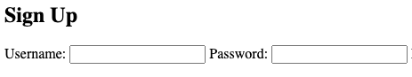
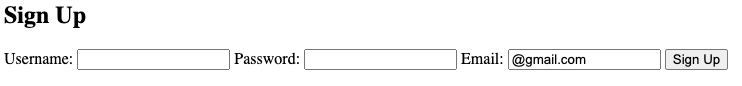
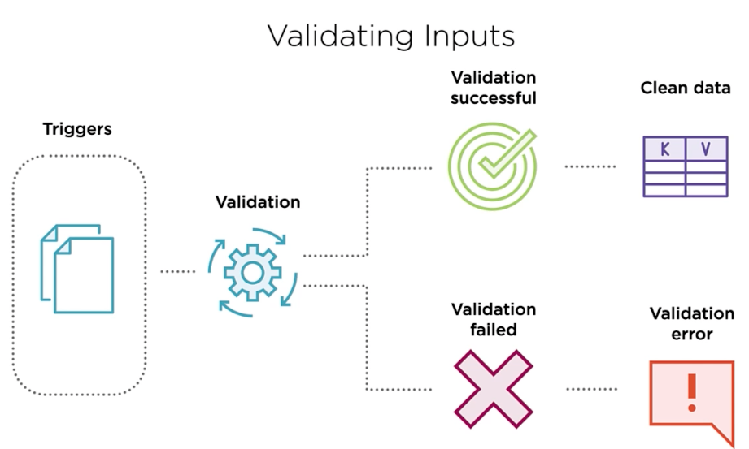

# Django Forms


## Types

- ###### Forms

  - `Class forms.Form`
  - Manually Configured

- ###### Model Forms

  - `Class forms.ModelForm`
  - Used when model edited via form
  - Special case of Forms

---

#### Basic Form

> ```python
> class MyForm(forms.Form):
>    name = forms.CharField()
>    description = forms.CharField(widget=forms.Textarea(attrs={"rows": 2}),required=False)
>    sector = forms.ChoiceField(widget=forms.RadioSelect,choices=SECTOR_CHOICES)    
>    site_id_old = forms.CharField(label="Site ID")
> 
> ```
>
> ###### FIelds
>
> ```python
> from rich import inspect
> 
> inspect(Field)
> 
> # base model for fields
> class Field(
> *, 
> required=True,              # Boolean that specifies whether the field is required.
> widget=None,                # A Widget class, or instance of a Widget class, that should be used for this Field when displaying it. 
> 														#  Each Field has a default Widget that it'll use if you don't specify this(most cases, default TextInput(
>   label=None,                 # A verbose name for this field, for use in displaying this field in a form
>   initial=None,               # A value to use in this Field's initial display
>   help_text='',               # An optional string to use as "help text" for this Field
>   error_messages=None,        # An optional dictionary to override the default messages that the field will raise.
>   show_hidden_initial=False,  # 
>   validators=(),              # List of additional validators to use
>   localize=False,             #
>   disabled=False,             #
>   label_suffix=None           # Suffix to be added to the label
> )
> 
> class CharField(
> *, 
> max_length=None, 
> min_length=None, 
> strip=True, 
> empty_value='', 
> **kwargs
> )
> ```
>
> ###### Fields and Widgets
>
> ```python
> # django.forms.fields
> class Field
> 	class CharField(Field)
> 	class RegexField(CharField)
>  class EmailField(CharField)
>  class URLField(CharField)
>  class GenericIPAddressField(CharField)
>  class SlugField(CharField)
>  class UUIDField(CharField)
>  class JSONField(CharField)
> 
> class IntegerField(Field)
> 	class FloatField(IntegerField)
>  class DecimalField(IntegerField)
> 
> class BaseTemporalField(Field)
> 	class DateField(BaseTemporalField)
>  class TimeField(BaseTemporalField)
>  class DateTimeField(BaseTemporalField)
> 
> class DurationField(Field)
> 
> class FileField(Field)
> 	class ImageField(FileField)
> 
> class BooleanField(Field)
> 	class NullBooleanField(BooleanField)
> 
> class ChoiceField(Field)
> 	class TypedChoiceField(ChoiceField)
>  class MultipleChoiceField(ChoiceField)
>  	class TypedMultipleChoiceField(MultipleChoiceField)
>  class FilePathField(ChoiceField)
> 
> class ComboField(Field)
> 
> class MultiValueField(Field)
> 	class SplitDateTimeField(MultiValueField)
> 
> # django.forms.widgets ================================================================
> class Input(Widget)
> 	class TextInput(Input)
> class NumberInput(Input)
> class EmailInput(Input)
> class URLInput(Input)
> class PasswordInput(Input)
> class HiddenInput(Input)
> 	class MultipleHiddenInput(HiddenInput)
> class FileInput(Input)
> 	class ClearableFileInput(FileInput)
> class CheckboxInput(Input)
> 
> class Textarea(Widget)
> 	class DateTimeBaseInput(TextInput)
> 		class DateInput(DateTimeBaseInput)
> 		class DateTimeInput(DateTimeBaseInput)
> 		class TimeInput(DateTimeBaseInput)
> 
> class ChoiceWidget(Widget)
> 	class Select(ChoiceWidget)
> 		class NullBooleanSelect(Select)
> 		class SelectMultiple(Select)
> 	class RadioSelect(ChoiceWidget)
> 	class CheckboxSelectMultiple(ChoiceWidget)
> 
> class MultiWidget(Widget)
> 	class SplitDateTimeWidget(MultiWidget)
> 		class SplitHiddenDateTimeWidget(SplitDateTimeWidget)
> 
> class SelectDateWidget(Widget)
> ```
>
> ### Examples
>
>   
>
> ```python
> class JobFormType1(forms.Form):
>   # CharField ======================
>   name_1 = forms.CharField()
>   name_2 = forms.CharField(required=False)
>   name_3 = forms.CharField(label='Custom label')
>   name_4 = forms.CharField(help_text='help text')
>   name_5 = forms.CharField(initial='initial value')
>   # CharField Widgets ======================
>   description_1 = forms.CharField(widget=forms.Textarea(attrs={"rows": 2}))
> ```
>
> d
>
> ```python
> class JobFormType1(forms.Form):
>     # CharField Widgets ======================
>     description_1 = forms.CharField(widget=forms.Textarea(attrs={"rows": 2}))
> ```
>
> 


## Model Form

> ```python
> class User(models.Model):
>   # Add an app_label attribute to the model class
>   app_label = 'coffeeshop'
> 
>   username = models.CharField(max_length=200)
>   password = models.CharField(max_length=200)
> 
>   def __str__(self):
>     return self.username
> ```
>
> ```python
> class UserForm(forms.ModelForm):
>   class Meta:  
>     model = User
>     fields = ['username', 'password']
>     # fields = '__all__' can be written like this to include all fields
> ```
>
>  
>
> 
>
> ###### Overwrite default save method
>
> ```python
> from django.contrib.auth.hashers import make_password
> 
> class UserForm(forms.ModelForm):
>   class Meta:  
>     model = User
>     fields = ['username', 'password']
> 
>     def save(self, commit=True, *args, **kwargs):
>       m = super().save(commit=False)
>       m.password = make_password(self.cleaned_data.get('password'))
>       m.username = self.cleaned_data.get('username').lower()
>       if commit:
>         m.save()
>         return m   # for always returns a model, 'm' stand for model
> ```
>
> 
>
> ###### Prefill Form Field
>
> ```python
> # add email field
> # model
> class User(models.Model):
>   username = models.CharField(max_length=200)
>   password = models.CharField(max_length=200)
>   email = models.EmailField()                   # added email field
> 
>   def __str__(self):
>     return self.username
> 
> # forms
> class UserForm(forms.ModelForm):
>   class Meta:  
>     model = User
>     fields = ['username', 'password', 'email'] # added 'emial'
> 
>     def save(self, commit=True, *args, **kwargs):
>       m = super().save(commit=False)
>       m.password = make_password(self.cleaned_data.get('password'))
>       m.username = self.cleaned_data.get('username').lower()
>       if commit:
>         m.save()
>         return m
>         
> # views
> def Signup(request):
>   if request.method == 'POST':
>     form = UserForm(request.POST)
>     if form.is_valid():
>       form.save()
>       return redirect('thanks')
>     else:
>       # create a blank form
>       form = UserForm(initial={'email':'@gmail.com'})  # add initial value to email
>       return render(request, 'signup.html', {'form': form,})
> ```
>
>  

----

## Validating Inputs

 


## Templates

```python
{{ form }}    # displys form
{{ form.as_p }}  # displays each field in a <p> tag to split onto new lines
```


---

## Examples 

> ### Blog Post
>
> ```python
> # urls
> from django.urls import path
> from .views import get_posts, post_detail, new_post, edit_post
> 
> urlpatterns = [
>     path('new_post', new_post, name='new_post'),
>     path('<int:pk>/edit', edit_post, name='edit_post'),
>     path('<int:pk>/', post_detail, name='post_detail'),
>     path('', get_posts, name='get_posts'),
> ]
> 
> # models
> from django.db import models
> from django.utils import timezone
> from django.contrib.auth.models import User
> from django.conf import settings
> from django.contrib.auth import get_user_model
> 
> def get_sentinel_user():
>     return get_user_model().objects.get_or_create(username='[user deleted]')[0]
> 
> class Post(models.Model):
>     """
>     A single Blog post
>     """
>     title = models.CharField(max_length=200)
>     content = models.TextField()
>     created_date = models.DateTimeField(auto_now_add=True)
>     published_date = models.DateTimeField(blank=True, null=True, default=timezone.now)
>     views = models.IntegerField(default=0)
>     tag = models.CharField(max_length=30, blank=True, null=True)
>     image = models.ImageField(upload_to="images", blank=True, null=True)
>     author = models.ForeignKey(User, related_name='posts', on_delete=models.SET(get_sentinel_user), null=False)
>     likes = models.ManyToManyField(User, related_name='liked_posts')
> 
>     
>     def __str__(self):
>         return self.title
> 
> # forms.py
> from django import forms
> from .models import Post
> 
> class BlogPostForm(forms.ModelForm):
>     class Meta:
>         model = Post
>         fields = ('title', 'content', 'image', 'tag', 'published_date')
> 
> # views
> def new_post(request):
>     if request.method == "POST":
>         form = BlogPostForm(request.POST, request.FILES)
>         if form.is_valid():
>             post = form.save(commit=False)
>             post.author = request.user
>             post.save()
>             return redirect('post_detail', post.pk)
>     else:
>         form = BlogPostForm()
>         
>     return render(request, 'posts/blogpostform.html', {'form': form})
>         
>         
> def edit_post(request, pk):
>     post = get_object_or_404(Post, pk=pk)
>     user = request.user
>     
>     if not(request.user == post.author or request.user.is_superuser):
>         return HttpResponseForbidden()
> 
>     if request.method == "POST":
>         form = BlogPostForm(request.POST, request.FILES, instance=post)
>         if form.is_valid():
>             post = form.save()
>             return redirect('post_detail', post.pk)        
>     else:
>         form = BlogPostForm(instance=post)
> ```
>
> ```html
> <!-- blogpostform.html -->
> 
> 
> 
>   <h1>New Post</h1>
>   <form method="POST" enctype="multipart/form-data">
>     
>     {{ form | as_bootstrap }}
>     <button type="submit" class="btn btn-info">Save</button>
>   </form>
> 
> ```
>

> #### Leaflet Map
>
> ```python
> pip install django-leaflet
> pip install geopandas
> pip install shapely
> ```
>
> ```python
> # models.py
> from django.contrib.gis.db import models
> from django.contrib.gis.geos import Point
> 
> class Profile(models.Model):
>     user = models.OneToOneField(CustomUser, on_delete=models.CASCADE)
>     location = models.PointField()
>     has_set_location = models.BooleanField(default=False)
> @receiver(post_save, sender=CustomUser)
> def create_user_profile(sender, instance, created, **kwargs):
>     if created:
>         Profile.objects.create(user=instance, location=Point(x=-6.36, y=53.3545))
> 
> 
> # forms
> from django import forms
> from leaflet.forms.widgets import LeafletWidget
> from leaflet.forms.fields import PointField
> from .models import Profile
> 
> class ProfileUpdateForm(forms.ModelForm):
>     location = PointField()
>     class Meta:
>         model = Profile
>         fields = ['location']
>         widgets = {'location': LeafletWidget()}
> 
> 
> # view.py
> import geopandas as gpd
> import json
> import requests
> from shapely.geometry import Point
> 
> def point_in_allowed_council(point):
>     file = f"{os.getcwd()}/static/data/councils-dublin.geojson"
>     df = gpd.read_file(file)
>     df = df[df.ENGLISH != 'other']
>     result = False
>     p1 = Point(point.x, point.y)
> 
>     for index, row in df.iterrows():
>         poly = row['geometry']
>         if p1.within(poly):
>             result = True
>             break
>     return result
> 
> # set location of new/existing user
> @login_required
> def choose_location(request):
>     # set/update location of a user
>     if request.method == 'POST':
>         profile_form = ProfileUpdateForm(request.POST, instance=request.user.profile)
>         if profile_form.is_valid():
>             point = profile_form.cleaned_data.get('location')
>             if not point_in_allowed_council(point):
>                 messages.warning(request, f'Location not available, please choose location inside available boundaries')
>                 return redirect('choose_location')
> 
>             # set locaiton of a new user
>             if not request.user.profile.has_set_location:
>                 profile_form.save()
>                 request.user.profile.has_set_location = True
>                 request.user.save()
>                 return redirect('home')
>             # update the location of an existing user
>             else:
>                 messages.success(request, f'New location has been set')
>                 profile_form.save()
>                 return redirect('home')
>     else:
>         profile_form = ProfileUpdateForm(instance=request.user.profile)
>         # show account created success message for new users
>         if not request.user.profile.has_set_location:
>             messages.success(request, f'Account created for {request.user.email} !')
>     return render(request, 'users/choose-location.html', {'profile_form': profile_form})
> ```
>
> ```html
> 
> 
> 
> 
> 
> 
> 
> 
> 
> 
> <div class="mobile-form location-form content-section ">
>     <form class="px-sm-5 register-profile" method="POST" enctype="multipart/form-data">
>         
>         <fieldset class="form-group">
>             <legend class="mb-sm-4">Set Location</legend>
>             To set location:
>             <ul>
>                 <li>Zoom to desired location on the map</li>
>                 <li>Click the marker icon<div
>                         class="align-middle d-inline-block leaflet-bar leaflet-draw-toolbar ml-2 mt-0"><a
>                             title="Draw a marker"></a></div>
>                 </li>
>                 <li>Click the Map to place marker</li>
>                 <li>Click the "Set Location" button</li>
>             </ul>
>             {{ profile_form }}
>         </fieldset>
>         <div class="form-group">
>             <button class="btn btn-outline-info" type="submit">Set Location</button>
>         </div>
>     </form>
> </div>
> 
> 
> 
> 
> {% endblock javascript %
> ```
>
> 

