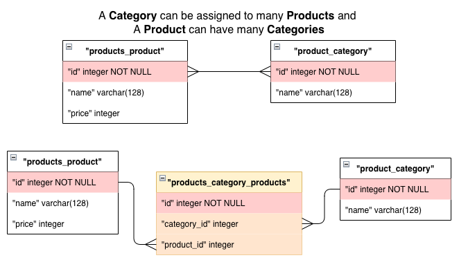

# Django Models

---

https://github.com/codesensei-courses/django-models

What does the Model Layer Do?

- Mapped to DB Tables
- Generate UI (ModelForm)
- Validate forms
- Generate admin interface
- Add custom methods


---

## Django Model Classes and Instances

#### What is a model

- a python class

- Each model class is mapped to a database table

#### What is a Migration

- Python script to update the database
- keeps DB structure in sync with code
- Typically auto-generated, but if project becomes complex, need to write oen migration code

##### Basic Model Creation

> ```python
> # store/models.py
> from django.db import models
> 
> class Product(models.Model):
>     name = models.CharField(max_length=100)
>     stock_count = models.IntegerField(help_text="How many items are currently in stock.")
>     price = models.DecimalField(max_digits=6, decimal_places=2)
> ```
>
> ```bash
> # command line
> python manage.py makemigrations  # => creates a migration file store/migrations/0001_initial.py
> 
> python manage.py sqlmigrate store 0001  # view sql code for the migration
> 
> python manage.py migrate # update the database with migrations
> ```


---

## Django Model Fields

Docs: [Django Model Field Reference](https://docs.djangoproject.com/en/4.1/ref/models/fields/)

Commen Field Types

> ```python
> # Storing Numbers
> BooleanField()  
> IntergerField() 
> FloatField()
> DecimalField()
> 
> # Storing Text
> CharField(max_length=10)  # store text of a specified max length, must contain 'max_length' arg
> TextField()							  # store large amounts of text
> 
> # Less common, just text field with some validation
> EmailField()
> URLField()
> FilePathField()
> SlugField()
> GenericIPAddressField()
> ```

##### Adding Text Field to Existing Databse Table

> ```python
> class Product(models.Model):
>     name = models.CharField(max_length=100)
>     stock_count = models.IntegerField(help_text="How many items are currently in stock.")
>     price = models.DecimalField(max_digits=6, decimal_places=2)
>     
>     # Options
>     description = models.TextField(null=True)  # allows value to be NULL, not recomended
>     description = models.TextField(default="") # set value to empty string
>     
>     # Other Options
>     # blank=True => allows empty values in a form
>     models.TextField(default="", blank=True) # Allow the form field to be left empty
>     # Add unique constraint
>     models.CharField(unique=True) # each value can only occur once
>     # Add an index
>     models.CharField(db_index=True)
>     # Set column name
>     models.CharField(db_column="my_column_name")
>     # Type-specific options
>     models.DateTimeField(auto_now=True)
>     # Set Form Field Label
>     iban = models.CharField(verbose_name="Bank Account")
>     # Set Form Field Help Text
>     name = models.CharField(help_text="Enter your full name")    
> ```
>
> 


### Table Relationships

#### One-To-Many Relation

Example: Produt can have many Images

> ```python
> class Product(models.Model):
>     name = models.CharField(max_length=100)
>     stock_count = models.IntegerField(help_text="How many items are currently in stock.")
>     price = models.DecimalField(max_digits=6, decimal_places=2)
>     description = models.TextField(default="", blank=True)
>     sku = models.CharField(verbose_name="Stock Keeping Unit", max_length=20, unique=True)
> 
> class ProductImage(models.Model):
>     image = models.ImageField()
>     product = models.ForeignKey('Product', on_delete=models.CASCADE) # maps to Product table
> 
> # on_delete=models.CASCADE => when Product deleted, all related images are deleted also
> ```

#### Many-To-Many Relation

- Doc: https://docs.djangoproject.com/en/4.1/ref/models/fields/#manytomanyfield

- Doc Examples: https://docs.djangoproject.com/en/4.1/topics/db/examples/many_to_many/

- [Extra fields on many-to-many relationships](https://docs.djangoproject.com/en/4.1/topics/db/models/#extra-fields-on-many-to-many-relationships)

- Arguement Defaults

  ```python
  to,
  related_name=None,
  related_query_name=None,
  limit_choices_to=None,
  symmetrical=None,
  through=None,
  through_fields=None,
  db_constraint=True,
  db_table=None,
  swappable=True,
  ```


- Example: Product can have many Categories, and a Coegory can be assigned to many Products

> ```python
> # products/models.py
> class Product(models.Model):
>  name = models.CharField(max_length=100)
>  price = models.DecimalField(max_digits=6, decimal_places=2)
> 
> class Category(models.Model):
>  name = models.CharField(max_length=100)
>  products = models.ManyToManyField('Product')
> ```
>
> Create the following tables
>
>  
>
> Command line example
>
> ```python
> # CREATION
> # create products
> p1 = Product(name='hoover', price=50)
> p1.save()
> p2 = Product(name='table', price=60)
> p2.save()
> 
> # create a category
> c1 = Category(name='home')
> c1.save()
> 
> # add a product to a category
> c1.products.add(p1)
> 
> # create new product and add to existing category
> c1.products.create(name='bed', price=300)
> 
> # add multiple products to a category
> c2 = Category(name='furniture')
> c2.save()
> p3 = Product.objects.get(name='bed')
> c2.products.add(p2, p3)
> ```
>
> ```bash
> # SQL VIEW AFTER CREATION
> 
> 'products_product'            'products_category'     'products_category_products'                                            
> id    name      price         id    name              id    category_id  product_id                         
> ----  --------  -------       ----  ----------        ----  -----------  ----------                      
> 1     hoover    50            1     home              1     1            1                                  
> 2     table     60            2     furniture         2     1            3                                  
> 3     bed       300                                   3     2            2              
>                                                          4     2            3                                                             
> # hoover part of the home category
> # table  part of the furniture category
> # bed.   part of the home + furniture category
> ```
>
> ```python
> # RETRIVAL
> # Get products from a category: Get all Furniture Products
> furn = Category.objects.get(name='furniture')
> furn.products.all()
> 	>> <QuerySet [<Product: table>, <Product: bed>]>
> 
> # Get categories from a product
> Product.objects.get(name='bed').category_set.all()
> 	>> <QuerySet [<Category: home>, <Category: furniture>]>
> 
> # Filter category by product and visa-versa
> Category.objects.filter(products__name='table')
> 	>> <QuerySet [<Category: furniture>]>
> Product.objects.filter(category__name='home')
> 	>> <QuerySet [<Product: hoover>, <Product: bed>]>
>   
> ```


---

## Customizing Model Behaviour

#### The Model Meta Class

> We add a `Meta` class to the model
>
> Doc: https://docs.djangoproject.com/en/4.1/ref/models/options/
>
> Examples
>
> ```python
> class Category(models.Model):
>     name = models.CharField(max_length=100)
>     products = models.ManyToManyField('Product', related_name="categories")
> 
>     class Meta:
>        # Sets the name in the Admin panel, by default admin panel justs adds an 's' i.e. Categorys
>         verbose_name_plural = "Categories"
>         # sets default ordering of Category to be name
>         ordering = ['name']
> ```
>
> Commonly Used
>
> ```python
> db_table = 'music_ablum'  # override the default tablename in the DB
> 
> # set columns to be indexed
> indexes = [
>   models.Index(fields=['last_name', 'first_name']),
>   models.Index(fields=['first_name'], name='first_name_idx'),
> ]
> 
> # add constraint, e.g check that the price of a product is greater than 0
> constraints = [
>   models.CheckConstraint(check=models.Q(price__gte=0),
>                          name="price_not_negative") # each constraint must get a unique name
> ]
> ```

#### Custom Methods

> ###### Example 1: Add `@property` method to class
>
> ```python
> class Product(models.Model):
>    name = models.CharField(max_length=100)
>    price = models.DecimalField(max_digits=6, decimal_places=2)
> 
>   @property                          # added method to get vat of a Product
>   def vat(self):
>     	return Decimal(.2) * self.price
> ```
>
> ##### Example 2: `get_absolute_url`
>
> ```python
> from django.urls import reverse
> 
> class Product(models.Model):
>     name = models.CharField(max_length=100)
> 		...
> 
>     def get_absolute_url(self):  # This is used in the Admin panel to take the user to the Product Page
>         return reverse("store:product-detail", kwargs={'pk': self.id})
> 
> # can be used in templates
> 
>     <div class="row">
>         <div class="col-md-3" style="padding-bottom:1em;">
>             <h3 class="text-secondary">
>                 <a href="{{ p.get_absolute_url }}">{{ p.name }}</a> # used to add link to product detail page
>             </h3>
>             ...
>         </div>
>     </div>
> 
> ```
>
> ##### Example 3: Add Slug field to Model
>
> ```python
> # Automatically add slug field to model on createion
> # Slug: short text that can be used if the url for the Product
> from django.utils.text import 
> 
> class Product(models.Model):
>     name = models.CharField(max_length=100)
>     slug = models.SlugField()   # add slug field
> 
>  # overwrite save method so we can add own logic
>     def save(self, *args, **kwargs):
>       	# check if slug is there, if not create it
>         if not self.slug:
>             self.slug = slugify(self.name)
>         return super().save(*args, **kwargs)
> 
> ```
>
> ### NOTE: Dont Override the ____init____ method
>
> Use `@classmethod` instead (Doc: https://docs.djangoproject.com/en/4.1/ref/models/instances/#django.db.models.Model)
>
> ```python
> from django.db import models
> 
> class Book(models.Model):
>     title = models.CharField(max_length=100)
> 
>     @classmethod                      # add a class method for creating a book, given a title
>     def create(cls, title):
>         book = cls(title=title)
>         
>         ...                           # do something with the book
>         
>         return book
> 
> book = Book.create("Pride and Prejudice") # add a class method for creating a book, given a title
> ```
>
> also, instead of this, you can create a `Custom Managerz`

#### Custom Managers

> Doc: https://docs.djangoproject.com/en/4.1/topics/db/managers/#custom-managers
>
> Desc: A `Manager` is the interface through which database query operations are provided to Django models.
>
> You can use a custom `Manager` in a particular model by extending the base `Manager` class and instantiating your custom `Manager` in your model.
> Reasons:
>
> 1. to add extra `Manager` methods
> 2. to modify the initial `QuerySet` the `Manager` returns
>
> Example 1: 
>
> ```python
> # same as the @classmethod above but with a custom manager
> class BookManager(models.Manager):
>     def create_book(self, title):
>         book = self.create(title=title)
>         # do something with the book
>         return book
> 
> class Book(models.Model):
>     title = models.CharField(max_length=100)
> 
>     objects = BookManager()
> 
> # ----------------------------------------------------------------------
> book = Book.objects.create_book("Pride and Prejudice")
> ```
>
> Example 2: replacing a much used `filter()` with a Custom manager
>
> - Want to filter out products that are not in stock
> - But, want to be able to still see these products
>
> ```python
> class ProductInStockQuerySet(models.QuerySet):  # create a custom QuerySet for models that are in stock
>     def in_stock(self):
>         return self.filter(stock_count__gt=0)
> 
> 
> class Product(models.Model):
>     name = models.CharField(max_length=100)
>     stock_count = models.IntegerField(help_text="How many items are currently in stock.")
>     price = models.DecimalField(max_digits=6, decimal_places=2)
> 
>     in_stock = ProductInStockQuerySet.as_manager()  
> 
> # ----------------------------------------------------------------------
> Products.objects.all()   # get all products
> Products.in_stock.all()  # get all products that have a stock count greater that 0
> ```
>
> 

#### Model Inheritence

> In general, try to avoid this
>
> Doc: https://docs.djangoproject.com/en/4.1/topics/db/models/#model-inheritance


---

## Migrations

#### Migration Commands

> ```bash
> python manage.py showmigrations         # list all migration for the project, sorted by app
> python manage.py showmigrations <app>   # list migrations for a specified app
> ```
>
> ```bash
> python manage.py sqlmigrate <app> <migration number>  # show sql for a specified migration
> python manage.py sqlmigrate store 0002
> ```
>
> ```bash
> python manage.py makemigrations         # create migrations for project
> python manage.py makemigrations <app>   # create migration for a specified app
> ```
>
> ```bash
> python manage.py migrate         # run all migrations that are not applied yet
> python manage.py migrate store   # run all migrations that are not applied yet for the store app
> 
> # if current migration is 0006
> python manage.py migrate store 0005  # revert back to the previous migration
> python manage.py migrate store zero  # revert back to start of project
> ```

#### Understanding Migration File

#### Merging Migrations

#### Squashing Migrations

#### Custom Migrations

#### Fixtures

> ```bash
> python manage.py dumpdata -o fixtures/my_data.json  # dump database data to a file
> python manage.py loaddata fixtures/my_data.json     # load dumped data into database
> ```


---


#### Transactions

> 

